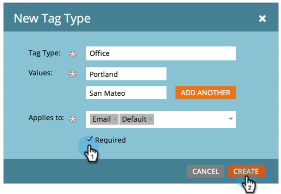

# Criar uma nova tag de Programa e valores de tag {#create-a-new-program-tag-and-tag-values}

>[!NOTE]
>
>**Permissões de administrador necessárias**

Você pode criar [tags](../../../product-docs/core-marketo-concepts/programs/working-with-programs/understanding-tags.md) personalizadas para seus programas e atribuir valores à tag .

>[!NOTE]
>
>**Exemplo**
>
>Tag do programa: Audiência público alvo
>
>Valor da tag do programa: SMB, Empresa, Mercado Médio

1. Em **Admin**, clique em **Tags**.

   

1. Clique em **Novo** e selecione **Novo tipo** de tag.

   

1. Insira o Tipo **de** tag e um **Valor** de tag. Em seguida, clique em **Adicionar outro**.

   

1. Insira quantos Valores forem necessários. Selecione a que tipos de programas você deseja que esta tag seja aplicada.

   

   >[!TIP]
   >
   >Você pode selecionar vários tipos de programas. Quando um novo programa for criado, esse tipo de tag estará disponível.

1. Marque **Obrigatório** e clique em **Criar**.

   

   >[!NOTE]
   >
   >Se o tipo de tag for **Obrigatório**, os usuários precisarão digitar um valor para a tag ao criar um novo programa.

   

Agora, quando seus usuários criam um programa, eles terão que definir o valor personalizado para a tag criada.