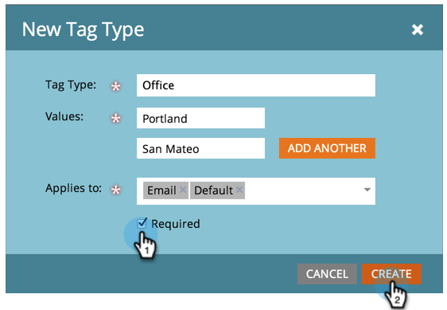
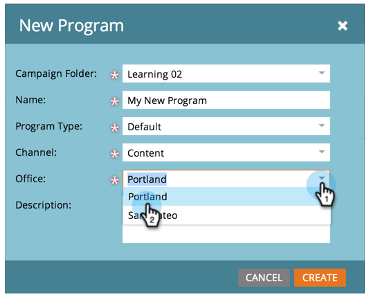

# Criar uma nova tag de programa e valores de tag {#create-a-new-program-tag-and-tag-values}

>[!NOTE]
>
>**Permissões de administrador são necessárias**

Você pode criar [tags](/help/marketo/product-docs/core-marketo-concepts/programs/working-with-programs/understanding-tags.md) personalizadas para seus programas e atribuir valores à tag.

>[!NOTE]
>
>**Exemplo**
>
>Tag de programa: Público-alvo
>
>Valor da etiqueta do programa: SMB, Enterprise, Mid-Market

1. Vá para a área **[!UICONTROL Administrador]**.

   

1. Clique em **[!UICONTROL Marcas]**.

   

1. Clique em **[!UICONTROL Novo]** e selecione **[!UICONTROL Novo Tipo de Marca]**.

   

1. Insira o **[!UICONTROL Tipo de Marca]** e uma marca **[!UICONTROL Valor]**. Depois clique em **[!UICONTROL Adicionar outro]**.

   

1. Insira quantos valores forem necessários. Selecione a quais tipos de programas você deseja aplicar esta tag.

   

   >[!TIP]
   >
   >Você pode selecionar vários tipos de programas. Quando um novo programa for criado, esse tipo de tag estará disponível.

1. Marque **[!UICONTROL Obrigatório]** e clique em **[!UICONTROL Criar]**.

   

   >[!NOTE]
   >
   >Se o tipo de marca for **[!UICONTROL Obrigatório]**, os usuários precisarão inserir um valor para a marca ao criar um novo programa.

   

Agora, quando os usuários criarem um programa, precisarão definir o valor personalizado para a tag criada.
