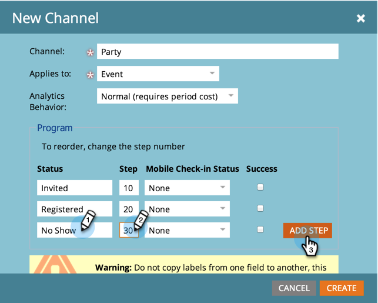
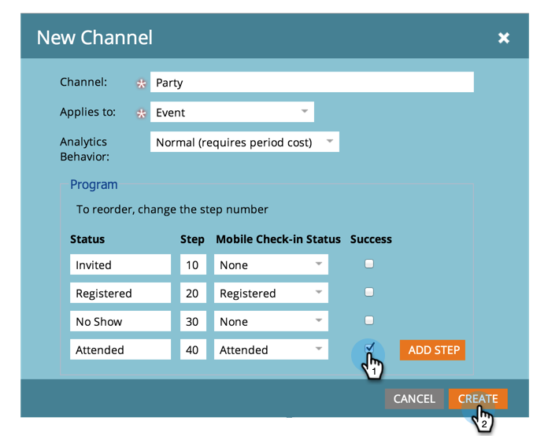

# Criar um canal de programa {#create-a-program-channel}

Um programa é uma iniciativa de marketing específica. O canal deve ser o mecanismo de entrega, como Webinar ou Patrocínio ou Anúncio online.

>[!NOTE]
>
>**Permissões de administrador são necessárias**

>[!NOTE]
>
>Saiba mais sobre [programas](/help/marketo/product-docs/core-marketo-concepts/programs/creating-programs/understanding-programs.md), o elemento mais importante do Marketo.

1. Vá para a área **[!UICONTROL Administrador]**.

   

1. Clique em **[!UICONTROL Marcas]**.

   

   >[!NOTE]
   >
   >Por que tags? Um canal é uma maneira de descrever um programa, como outras tags. O canal tem recursos extras especiais.

1. Clique no sinal **+** ao lado de [!UICONTROL Canal] para expandir e ver os canais existentes.

   

1. Em **[!UICONTROL Novo]**, clique em **[!UICONTROL Novo canal]**.

   

   >[!NOTE]
   >
   >**Exemplo**
   >
   >Canal: Outdoor
   >
   >* Aplicar a: Padrão
   >* Progressão: Membro, Envolvido (são padrões adequados)
   >* Sucesso: Envolvido
   >
   >Canal: Festa
   >
   >* Aplicar a: Evento
   >* Progressão: Convidado, Inscrito, Sem Apresentação e Presente
   >* Sucesso: Participou
   >
   >Revise o andamento dos canais existentes para obter orientação sobre como usá-los.

1. Usando o Canal de participante como exemplo, nomeie seu novo **[!UICONTROL Canal]** e selecione o tipo de programa ao qual ele será aplicado.

   

   >[!NOTE]
   >
   >Existem vários tipos de programas. Corresponda o canal ao tipo certo. Se não tiver certeza, escolha **[!UICONTROL Padrão]**.

   >[!NOTE]
   >
   >Ao usar o &quot;[!UICONTROL Evento com o Webinar]&quot;, os mapeamentos do sistema serão bloqueados (conforme exigido pelas integrações do webinário) e não poderão ser editados.

1. Insira os dois primeiros nomes de Status do programa e clique em **[!UICONTROL Adicionar etapa]**.

   

1. Digite o número da **[!UICONTROL Status]** e da **[!UICONTROL Etapa]** de outro programa e clique em **[!UICONTROL Adicionar Etapa]**.

   

   >[!TIP]
   >
   >O número **[!UICONTROL Etapa]** é usado para classificar os status do programa. Observe que as pessoas não podem retroceder nesses passos de progressão. Eles só podem alterar o status para um status de valor maior ou igual. Use os valores iguais quando os status pretenderem alternar entre si, em vez de uma progressão.

1. Insira o número do último programa **[!UICONTROL Status]** e **[!UICONTROL Etapa]**.

   

   >[!NOTE]
   >
   >Ao usar o tipo &quot;[!UICONTROL Evento]&quot;, o mapeamento do sistema para os status Registrado, Lista de Espera e Participou é necessário. Sendo assim, esses status não podem ser ocultos.

1. Escolha o **[!UICONTROL Status do Check-in para Dispositivos Móveis]** para **[!UICONTROL Registrado]**.

   

1. Escolha o **[!UICONTROL Status de check-in móvel]** para **[!UICONTROL Participou]**.

   

   >[!NOTE]
   >
   >As opções de **[!UICONTROL Status do Check-in para Dispositivos Móveis]** só estarão disponíveis se o canal for para programas de eventos.

   >[!NOTE]
   >
   >Somente as pessoas com **[!UICONTROL Status do Check-in para Dispositivos Móveis]** de **[!UICONTROL Registradas]** e **[!UICONTROL Participadas]** estarão visíveis nos [Aplicativos de Check-in para Dispositivos Móveis](/help/marketo/product-docs/core-marketo-concepts/mobile-apps/event-check-in/event-check-in-overview.md).

   >[!TIP]
   >
   >Se uma nova pessoa for criada no aplicativo de check-in para dispositivos móveis, ela será definida como [!UICONTROL Registrada] no programa de evento. Se uma pessoa tiver feito o check-in no evento no aplicativo, ele será definido como [!UICONTROL Participou] do programa de evento.

1. Selecione o status do programa **[!UICONTROL Sucesso]** e clique em **[!UICONTROL Criar]**.

   

   Quando você cria um novo programa desse tipo, esse novo canal será uma das opções.
