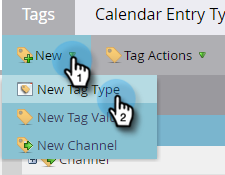

# Criar tags personalizadas {#create-custom-tags}

As tags ajudarão você a organizar seus programas, enquanto os canais ajudarão a coletar dados para fins de relatório.

>[!NOTE]
>
>Confira [Noções básicas sobre tags](/help/marketo/product-docs/core-marketo-concepts/programs/working-with-programs/understanding-tags.md) para obter mais informações.

>[!NOTE]
>
>**Permissões de administrador necessárias**

## Criar um novo tipo de tag {#create-a-new-tag-type}

Para criar um novo tipo de tag:

1. Vá para a seção **[!UICONTROL Admin]**.

   

1. Clique em **[!UICONTROL Marcas]**.

   

1. Clique em **[!UICONTROL Novo]** e selecione **[!UICONTROL Novo Tipo de Marca]**.

   

1. Digite um nome para o tipo de tag.

   

1. Insira o valor desejado para o Tipo de tag. Clique em **[!UICONTROL Adicionar outro]** para inserir valores adicionais.

   

1. Selecione a quais tipos de programas esta tag se aplica.

   

1. Decida se essa tag será ou não obrigatória para todos os tipos de programas listados.

   

   >[!NOTE]
   >
   >* Selecione &quot;[!UICONTROL Obrigatório]&quot; se quiser que essa marca seja adicionada sempre que um novo programa for criado.
   >* A remoção de um tipo de programa da lista &#39;[!UICONTROL Aplica-se a]&#39; excluirá a marca e seus valores de todos os programas existentes desse tipo. Se você quiser preservar os valores de marca existentes e tornar esta marca opcional avançando para _todos_ os tipos de programas listados, deixe a caixa de seleção &quot;Obrigatório&quot; desmarcada.

   >[!TIP]
   >
   >Se você quiser tornar uma marca semelhante necessária para alguns tipos de programas, mas opcional para outros, precisará configurar duas marcas separadas, cada uma se aplicando a tipos de programas diferentes, uma com &quot;[!UICONTROL Obrigatório]&quot; selecionado e a outra com &quot;[!UICONTROL Obrigatório]&quot; não selecionado.

1. Clique em **[!UICONTROL Criar]**.

   
