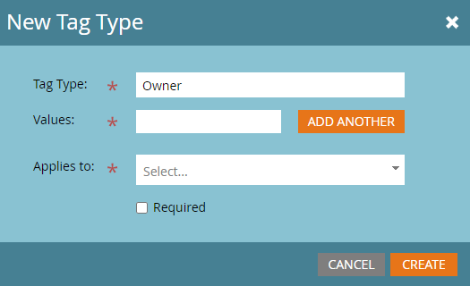

# Criar tags personalizadas {#create-custom-tags}

As tags ajudarão você a organizar seus programas, enquanto os canais ajudarão na coleta de dados para fins de relatório.

>[!NOTE]
>
>Veja [Compreensão de tags](/help/marketo/product-docs/core-marketo-concepts/programs/working-with-programs/understanding-tags.md) para obter mais informações.

>[!NOTE]
>
>**Permissões de administrador necessárias**

## Criar um novo tipo de tag {#create-a-new-tag-type}

Para criar um novo tipo de tag:

1. Vá para o **Administrador** seção.

   

1. Clique em **Tags**.

   

1. Clique em **Novo** e selecione **Novo tipo de tag.**

   

1. Insira um nome para o Tipo de tag.

   

1. Insira o valor desejado para o Tipo de tag. Clique em **Adicionar outro** para inserir valores adicionais.

   

1. Selecione a que tipo(s) de programa esta tag se aplica.

   

1. Decida se essa tag deve ou não ser exigida para todos os tipos de programas listados.

   

   >[!NOTE]
   >
   >* Selecione &quot;Obrigatório&quot; se desejar que essa tag seja adicionada sempre que um novo programa for criado.
   >* A remoção de um tipo de programa da lista &quot;Aplica-se a&quot; excluirá a tag e seus valores de todos os programas existentes desse tipo. Se desejar preservar os valores de tag existentes e tornar essa tag opcional, avance para _all_ tipos de programa listados, deixe a caixa de seleção &quot;Obrigatório&quot; desmarcada.

   >[!TIP]
   >
   >Se você quiser tornar uma tag semelhante necessária para alguns tipos de programa, mas opcional para outros, será necessário configurar duas tags separadas, cada uma aplicando-se a tipos de programa diferentes com uma com &quot;Obrigatório&quot; selecionado e a outra com &quot;Obrigatório&quot; não selecionado.

1. Clique em **Criar**.

   
