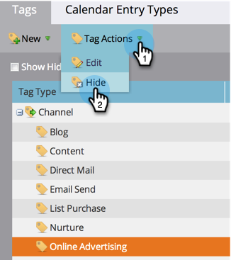

# Ocultar/reexibir um canal de programa {#hide-unhide-a-program-channel}

>[!NOTE]
>
>**Permissões de administrador são necessárias**

Você pode [excluir um canal de programa](/help/marketo/product-docs/administration/tags/delete-a-program-channel.md) se ele não estiver sendo usado por nenhum programa.  No entanto, uma vez usado, precisamos mantê-lo por perto.  No entanto, você pode ocultá-lo se não precisar mais dele.

## Ocultar um canal de programa {#hide-a-program-channel}

1. Vá para a área **[!UICONTROL Administrador]**.

   

1. Clique em **[!UICONTROL Marcas]**.

   

1. Clique no menu suspenso **[!UICONTROL Canal]** e selecione o **[!UICONTROL Canal]** para ocultar.

   

1. Em **[!UICONTROL Ações de Marca]**, clique em **[!UICONTROL Ocultar]**.

   

Calma, calma!

## Revelar um canal de programa {#unhide-a-program-channel}

1. Exiba novamente um Canal de Programa marcando a caixa de seleção **[!UICONTROL Mostrar Oculto]**.

   
