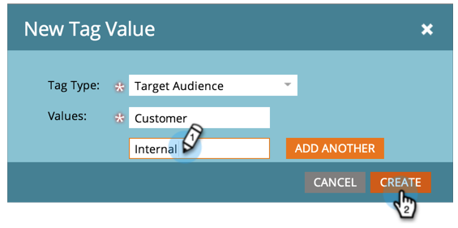

# Gerenciamento de valores de tag {#managing-tag-values}

[Marcas](/help/marketo/product-docs/core-marketo-concepts/programs/working-with-programs/understanding-tags.md) são usadas para descrever programas. Você pode criar quantos forem necessários, cada um com valores únicos. Veja como gerenciar esses valores.

>[!NOTE]
>
>**Permissões de administrador necessárias**

>[!PREREQUISITES]
>
>[Criar uma Nova Marca do Programa e Valores de Marca](/help/marketo/product-docs/administration/tags/create-a-new-program-tag-and-tag-values.md)

## Adicionar valores de tag {#adding-tag-values}

1. Vá para a área **[!UICONTROL Administrador]**.

   

1. Clique em **[!UICONTROL Marcas]**.

   

1. Clique em **[!UICONTROL Novo]** e depois em **[!UICONTROL Novo Valor de Marca]**.

   

1. Selecione o **[!UICONTROL Tipo de Marca]**.

   

1. Insira um **[!UICONTROL Valor]** e clique em **[!UICONTROL Adicionar outro]**. Você pode adicionar quantos valores desejar.

   

1. Adicione os valores restantes e clique em **[!UICONTROL Criar]**.

   

Você deve ver as alterações imediatamente!

## Ocultar valores de tag {#hiding-tag-values}

As tags podem ser usadas por programas antigos. Você pode substituí-los para uso futuro ocultando o tipo de tag.

1. Selecione a **[!UICONTROL Tag]** e selecione o **[!UICONTROL Valor]** que deseja ocultar.

   

1. Em **[!UICONTROL Ações de Marca]**, selecione **[!UICONTROL Ocultar]**.

   

## Mostrar valores ocultos {#show-hidden-values}

Se quiser ver seus valores ocultos novamente, faça o seguinte:

1. Marque a caixa de seleção **[!UICONTROL Mostrar ocultos]**. Depois de marcado, você poderá ver o valor oculto.

   

É possível tornar visíveis os valores que gostaria de usar no futuro.
