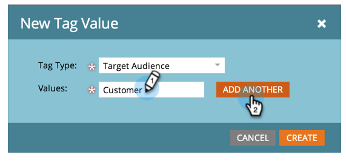

# Gerenciamento de valores de tag {#managing-tag-values}

[Tags](/help/marketo/product-docs/core-marketo-concepts/programs/working-with-programs/understanding-tags.md) são usados para descrever programas. Você pode criar quantos forem necessários, cada um com valores únicos. Veja como gerenciar esses valores.

>[!NOTE]
>
>**Permissões de administrador necessárias**

>[!PREREQUISITES]
>
>[Criar uma nova tag de programa e valores de tag](/help/marketo/product-docs/administration/tags/create-a-new-program-tag-and-tag-values.md)

## Adicionar valores de tag {#adding-tag-values}

1. Vá para a **[!UICONTROL Admin]** área.

   

1. Clique em **[!UICONTROL Tags]**.

   

1. Clique em **[!UICONTROL Novo]**, depois **[!UICONTROL Novo valor de tag]**.

   

1. Selecione o **[!UICONTROL Tipo de tag]**.

   

1. Insira um **[!UICONTROL Valor]** e clique em **[!UICONTROL Adicionar outro]**. Você pode adicionar quantos valores desejar.

   

1. Adicione os valores restantes e clique em **[!UICONTROL Criar]**.

   

Você deve ver as alterações imediatamente!

## Ocultar valores de tag {#hiding-tag-values}

As tags podem ser usadas por programas antigos. Você pode substituí-los para uso futuro ocultando o tipo de tag.

1. Selecione o **[!UICONTROL Tag]** e selecione o **[!UICONTROL Valor]** você quer se ocultar.

   

1. Em **[!UICONTROL Ações de tag]**, selecione **[!UICONTROL Ocultar]**.

   

## Mostrar valores ocultos {#show-hidden-values}

Se quiser ver seus valores ocultos novamente, faça o seguinte:

1. Selecione o **[!UICONTROL Mostrar ocultos]** caixa de seleção Depois de marcado, você poderá ver o valor oculto.

   

É possível tornar visíveis os valores que gostaria de usar no futuro.
