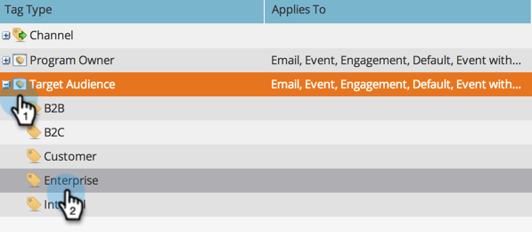

# Gerenciamento de valores de tag {#managing-tag-values}

[Tags](/help/marketo/product-docs/core-marketo-concepts/programs/working-with-programs/understanding-tags.md) são utilizados para descrever programas. Você pode fazer o quanto precisar, cada um com valores únicos. Veja como gerenciar esses valores.

>[!NOTE]
>
>**Permissões de administrador necessárias**

>[!PREREQUISITES]
>
>[Criar uma nova tag e valores de tag do programa](/help/marketo/product-docs/administration/tags/create-a-new-program-tag-and-tag-values.md)

## Adicionar valores de tag {#adding-tag-values}

1. Vá para o **Administrador** área.

   

1. Clique em **Tags**.

   

1. Clique em **Novo**, em seguida **Novo valor de tag**.

   

1. Selecione o **Tipo de tag**.

   

1. Insira um **Valor** e clique em **Adicionar outro**. Você pode adicionar quantos valores desejar.

   

1. Adicione os valores restantes e clique em **Criar**.

   

1. Você deve ver as alterações imediatamente!

   

## Ocultar valores de tag {#hiding-tag-values}

As tags podem ser usadas por programas antigos. Você pode descontinuá-las para uso futuro, ocultando o tipo de tag .

1. Selecione o **Tag** e selecione o **Valor** você quer se esconder.

   

1. Em **Ações de tag**, selecione **Ocultar**.

   

## Mostrar valores ocultos {#show-hidden-values}

Se quiser ver seus valores ocultos novamente, faça o seguinte:

1. Selecione a caixa Mostrar oculto . Depois de marcado, você pode ver o valor oculto.

   

Em seguida, é possível mostrar os valores que deseja usar no futuro.
