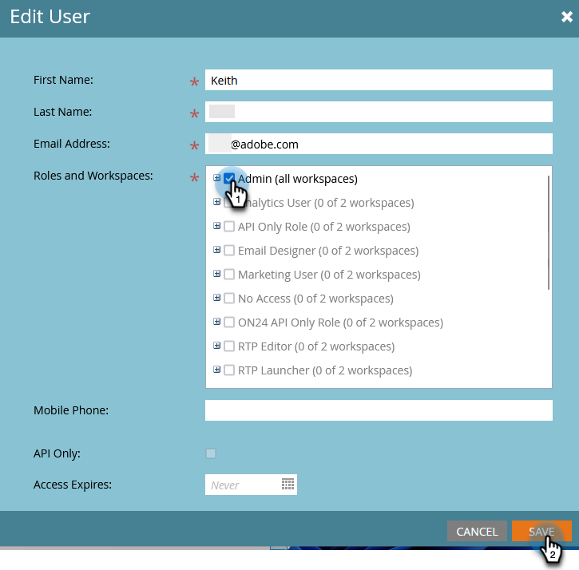

# Criar, Deletar, Editar e Alterar uma Atribuição do Usuário {#create-delete-edit-and-change-a-user-role}

**Funções** agrupam um conjunto de permissões. **Permissões** permitem que você faça coisas no Marketo. Você atribui uma **função** a um usuário. Fácil como torta.

>[!NOTE]
>
>**Permissões de administrador necessárias**

>[!IMPORTANT]
>
>As seguintes funções são funções do sistema e não podem ser editadas ou excluídas:
>
>* Administrador
>* Administrador de produtos da Adobe
>* Usuário padrão
>* Editor de RTP
>* Iniciador de RTP

## Criar uma função {#create-a-role}

1. Vá para a área **[!UICONTROL Administrador]**.

   

1. Clique em **[!UICONTROL Usuários e funções]**.

   

1. Vá para a guia **[!UICONTROL Funções]** e clique em **[!UICONTROL Nova Função]**.

   

1. Nomeie sua nova função, marque todas as permissões que deseja conceder aos usuários associados à função e clique em **[!UICONTROL Criar]**.

   

## Excluir uma função {#delete-a-role}

1. Vá para a área **[!UICONTROL Administrador]**.

   

1. Clique em **[!UICONTROL Usuários e funções]**.

   

1. Na guia **[!UICONTROL Funções]**, selecione uma função e clique em **[!UICONTROL Excluir função]**.

   

1. Confirme a exclusão clicando em **[!UICONTROL Excluir]**.

   

>[!NOTE]
>
>Primeiro, certifique-se de que nenhum usuário esteja atribuído a uma função; caso contrário, ela não poderá ser excluída.

## Editar uma função existente {#edit-an-existing-role}

>[!NOTE]
>
>Para editar sua própria função de usuário, é necessário fazer logon como outro usuário com direitos de Administrador.

1. Vá para a área **[!UICONTROL Administrador]**.

   

1. Clique em **[!UICONTROL Usuários e funções]**.

   

1. Clique na guia **[!UICONTROL Funções]**.

   

1. Selecione a função que você deseja editar e clique em **[!UICONTROL Editar Função]**.

   

1. Faça todas as alterações necessárias e clique em **[!UICONTROL Salvar]**.

   

   >[!NOTE]
   >
   >As alterações feitas na função afetarão todos os usuários associados a essa função.

   >[!TIP]
   >
   >Deseja atualizar o endereço de email da conta? [Saiba mais aqui](/help/marketo/product-docs/administration/settings/edit-account-settings.md).

## Alterar a função de um usuário {#change-a-users-role}

1. Vá para a área **[!UICONTROL Administrador]**.

   

1. Clique em **[!UICONTROL Usuários e funções]**.

   

1. Selecione o usuário ao qual você deseja atribuir uma função diferente e clique em **[!UICONTROL Editar Usuário]**.

   

1. Desmarque a função anterior, selecione a nova e clique em **[!UICONTROL Salvar]**.

   

>[!NOTE]
>
>Se você deixar várias funções selecionadas, o Marketo assumirá como padrão a permissão mais restritiva.
