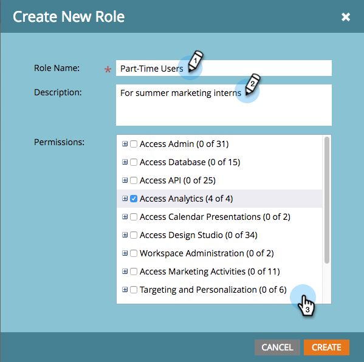

# Descrições de permissões de função {#descriptions-of-role-permissions}

Veja abaixo uma lista de todas as permissões disponíveis que você pode atribuir às suas funções. As permissões geralmente estão associadas a áreas funcionais específicas dentro do Marketo e podem ajudar você a controlar a quais áreas e funcionalidades diferentes usuários têm acesso.

Algumas informações adicionais sobre permissões:

* A permissão &quot;Acesso&quot; fornece uma permissão de função para exibir e, às vezes, editar essa parte do aplicativo.
* Para que uma função tenha acesso às subpermissões (&quot;Criar&quot;, &quot;Excluir&quot; etc.), essa função deve ter permissão de &quot;Acesso&quot; a essa parte do aplicativo. Por exemplo, se você quiser conceder permissão para Editar campanhas a alguém, essa pessoa deverá ter permissão geral para Acessar atividades de marketing.
* Você pode ver ações ou ativos que não tem permissão para usar. No entanto, se você tentar acessá-las, verá uma mensagem avisando sobre o acesso limitado.

## Permissões disponíveis {#available-permissions}

Ao [criar ou editar uma função](/help/marketo/product-docs/administration/users-and-roles/managing-user-roles-and-permissions.md), você pode selecionar quais das seguintes permissões devem ser permitidas para essa função, marcando as caixas apropriadas.

## Acessar administrador  {#access-admin}

Exiba e faça alterações nas configurações na seção Minha conta do Administrador.

* Acessar o Adobe Connect - Dá aos usuários acesso à tela do Adobe Connect
* Acessar o Adobe Experience Manager - Dá aos usuários acesso à tela do Adobe Experience Manager
* Acessar o mapeamento de organização da Adobe - Dá aos usuários acesso à tela Mapeamento de organização da Adobe
* Acessar trilha de auditoria do administrador - Concede aos usuários acesso à tela Trilha de auditoria do administrador
* Acessar trilha de auditoria de acesso - Concede aos usuários acesso à trilha de auditoria de acesso
* Acessar trilha de auditoria - Dá aos usuários acesso à trilha de auditoria do ativo e à trilha de auditoria do administrador.
* Acessar CAPTCHA - Acesso à tela CAPTCHA
* Canais de acesso - Concede aos usuários acesso somente para modificar a tag de Canal, não a outras tags personalizadas
* Limite de comunicação de acesso - Concede aos usuários acesso para ativar um limite de comunicação no Administrador
* Acessar CRM - Concede aos usuários acesso ao CRM, como [!DNL Salesforce] ou [!DNL Microsoft Dynamics], no Administrador
* Acesso `Data.com` - Concede aos usuários acesso à ação de fluxo Data.com
* Acessar administrador de email - Concede aos usuários acesso ao Administrador de email para alterar as configurações padrão, como domínios de cancelamento de inscrição e identidade visual
* Parceiros de evento de acesso - Fornece aos usuários acesso ao LaunchPoint no Administrador
* Acessar o compartilhamento de público-alvo da Experience Cloud - Fornece aos usuários acesso para sincronizar um público-alvo do Adobe Experience Cloud com o Marketo Engage
* Gerenciamento de campos de acesso - Concede aos usuários acesso ao Gerenciamento de campos no Administrador
* Acessar upload de arquivo - Oferece aos usuários a capacidade de carregar imagens e arquivos no Design Studio
* Acessar páginas de aterrissagem - Concede aos usuários acesso às páginas de aterrissagem no Admin
* Local de acesso - Dá aos usuários acesso ao Local no Admin para definir idioma, local, fuso horário e moeda padrão
* Acessar histórico de logon - Dá aos usuários acesso ao histórico de logon do usuário na trilha de auditoria
* Acessar configurações de logon - Dá aos usuários acesso às Configurações de logon nas configurações de Administração para segurança, Restrições de IP e Relatórios de lista inteligente
* Acessar nova experiência - Dá aos usuários acesso à tela Nova experiência
* Acessar a atividade personalizada do Marketo - Concede aos usuários acesso às Atividades personalizadas do Marketo no Administrador
* Acessar objeto personalizado do Marketo - Concede aos usuários acesso aos Objetos personalizados do Marketo no Administrador
* Acesso [!DNL Munchkin] - Concede aos usuários acesso a [!DNL Munchkin] em Administração, para definir o código de rastreamento, o rastreamento de pessoas e habilitar a configuração da API
* Acessar públicos preditivos - Concede aos usuários acesso à tela Públicos preditivos
* Acessar o Revenue Cycle Analytics - Dá aos usuários acesso ao Revenue Cycle Analytics no Admin para a configuração Sincronizar resumo e atribuição
* Funções de acesso - concede aos usuários acesso para gerenciar e editar funções, mas não aos usuários
* Acessar o Sales Insight - Dá aos usuários acesso para gerenciar o Sales Insight no Admin, para definir status, configuração de API, pontuação de pessoas e outras configurações
* Acesso ao Logon Único - Concede aos usuários acesso ao gerenciamento do Logon Único no Admin, para ativar o SAML e trabalhar com configurações de SAML e URLs de página de redirecionamento
* Acessar o Smart Campaign - Oferece aos usuários acesso ao Smart Campaign no Admin, para restringir os limites de pessoas qualificadas
* Acessar a API do SOAP - Fornece aos usuários acesso para gerenciar as APIs do SOAP nos Serviços da Web na Administração
* Tags de acesso - Concede aos usuários acesso a todas as tags personalizadas, exceto a tag de canal.
* Acessar o Treasure Chest - Dá aos usuários acesso aos recursos experimentais no Treasure Chest no Administrador
* Acessar usuários - Dá aos usuários acesso para editar e gerenciar usuários (mas não funções) no Admin
* Webhooks de acesso - Concede aos usuários acesso a Webhooks no Admin para a configuração de detalhes e Mapeamentos de resposta
* Acessar espaços de trabalho e partições - Concede aos usuários acesso para criar, editar e excluir espaços de trabalho e partições no Administrador

## API de acesso  {#access-api}

Concede aos usuários com **Somente API** **Função** acesso às APIs individuais listadas abaixo.

* Aprovar ativos
* Executar campanha
* Atividade somente de leitura
* Metadados de atividade somente de leitura
* Ativos somente de leitura
* Campanha somente de leitura
* Empresa somente de leitura
* Objeto personalizado somente de leitura
* Pessoa somente leitura
* Conta nomeada somente de leitura
* Oportunidade somente de leitura
* Pessoa de vendas somente de leitura
* Atividade de leitura-gravação
* Metadados de atividade de leitura e gravação
* Ativos de leitura-gravação
* Campanha de leitura-gravação
* Empresa de leitura-gravação
* Objeto personalizado de leitura-gravação
* Pessoa com leitura/gravação
* Conta nomeada de leitura e gravação
* Oportunidade de leitura-gravação
* Pessoa de vendas de leitura-gravação

## Acessar análises {#access-analytics}

Fornece aos usuários acesso às guias do Analytics, Insights de email, relatórios e aos três itens abaixo, a menos que estejam desmarcados.

* Acessar Gerenciador de Receita - Desmarcar remove o acesso do usuário ao Gerenciador de Receita
* Criar relatório - fornece aos usuários acesso para criar, clonar, ler, atualizar e mover ativos de relatório nas Atividades de análise e marketing, bem como ativos do Modeler do ciclo de receita
* Excluir relatório - Desmarcar remove a capacidade do usuário de excluir relatórios
* Exportar dados do Analytics - Desmarcar remove a capacidade do usuário de exportar dados do Analytics

## Acessar apresentações de calendários {#access-calendar-presentations}

Concede aos usuários acesso a apresentações de calendário - permite a exibição do botão Apresentações na parte inferior.

* Editar Apresentações do Calendário - Permite que os usuários editem apresentações no Calendário

## Acessar Estúdio de desenvolvimento {#access-design-studio}

Fornece aos usuários acesso à guia Design Studio e à visualização da árvore, mas não aos detalhes.

* Acessar e-mail
   * Editar email - Concede aos usuários permissão para editar, criar e clonar emails
      * Criar e editar emails operacionais - concede aos usuários permissão para criar e/ou editar emails operacionais. Consulte: [Tornar um email operacional](/help/marketo/product-docs/email-marketing/general/functions-in-the-editor/make-an-email-operational.md)

      * Aprovar email - Permite que os usuários aprovem emails.
      * Excluir email - Permite que os usuários excluam emails.
      * Definir domínio de marca - Permite que os usuários trabalhem com domínios de marca. Consulte: [Adicionar outro domínio de marca](/help/marketo/product-docs/administration/email-setup/add-multiple-branding-domains/add-an-additional-branding-domain.md)

* Acessar modelo de e-mail

   * Aprovar modelo de e-mail
   * Excluir modelo de e-mail
   * Editar modelo de e-mail - Edita, crie e clone modelos de e-mail

* Acessar formulário

   * Aprovar formulário
   * Excluir formulário
   * Editar formulário - Editar, criar e clonar formulários

* Acessar imagem

   * Excluir imagem
   * Carregar imagem

* Acessar página

   * Aprovar página
   * Excluir página de destino
   * Editar página de aterrissagem - Editar, criar e clonar páginas de aterrissagem

* Acessar modelo de página

   * Aprovar modelo de página
   * Excluir modelo de página
   * Editar modelo de página de aterrissagem - Edite, crie e clone modelos de página de aterrissagem

* Acessar bloco de conteúdo

   * Aprovar bloco de conteúdo
   * Excluir bloco de conteúdo
   * Editar bloco de conteúdo

* Acessar aplicativo social

   * Aprovar aplicativo social
   * Excluir aplicativo social
   * Editar aplicativo social

## Acessar banco de dados {#access-database}

Exibir o banco de dados, bem como exibir e editar listas inteligentes/estáticas.

* Acessar segmentação

   * Aprovar segmentação
   * Excluir segmentação
   * Editar segmentação

* Excluir pessoa
* Criar lista
   * Acesso para criar um ativo de lista em Atividades de banco de dados e marketing
   * Acesso para criar um ativo de lista inteligente no banco de dados e nas atividades de marketing
* Excluir lista
* Editar Pessoa - Impede a edição manual e a execução de etapas de fluxo único; você ainda pode editar pessoas executando campanhas com elas
* Exportar Pessoa - Exporte planilhas das listas do banco de dados
* Importar objeto personalizado
* Importar lista
* Mesclar pessoas
* Executar Ações de Fluxo Único - Permite que os usuários executem a etapa de fluxo **Alterar Valor de Dados** em pessoas do banco de dados

* Exibir dados da oportunidade - Oculta as informações da oportunidade na página de detalhes da pessoa

## Acessar atividades de marketing {#access-marketing-activities}

Exiba a guia Atividades de marketing, campanhas e pastas de campanha.

* Acessar mensagem de SMS

   * Aprovar mensagem de SMS
   * Excluir mensagem de SMS
   * Editar mensagem de SMS

* Acessar notificação por push

   * Aprovar notificação por push
   * Excluir notificação por push
   * Editar notificação por push

* Acessar prêmios
* Ativar campanha com gatilho
* Aprovar programa de e-mail
* Clonar ativo de marketing
* Excluir ativo de marketing
* Editar restrições de campanha
* Editar ativo de marketing
* Exportar Atividade de Campanha&#42;
* Importar programa
* Importação de lista
* Programar campanha em lote

Acessar SEO

* Administrar SEO
* SEO padrão

## Direcionamento e personalização {#targeting-and-personalization}

* Administrar personalização na Web
* Editor de campanhas de CRE
* Iniciador de campanhas de CRE
* Editor de campanhas on-line
* Iniciador de campanhas on-line

Administração da área de trabalho

* Acesso de administrador a uma Workspace específica (somente se você tiver os Espaços de trabalho ativados)
* Mover ativos entre espaços de trabalho (somente se tiver espaços de trabalho ativados)
