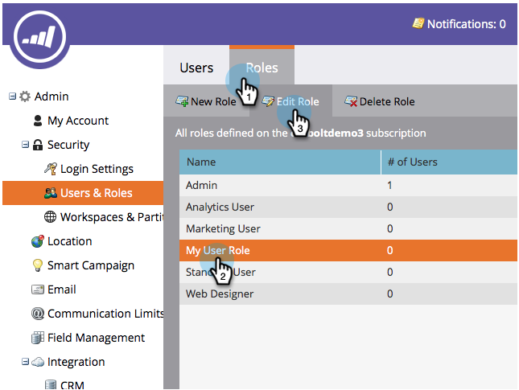

# Ativar a permissão de importação de Lista avançada em uma função {#enable-the-advanced-list-import-permission-on-a-role}

O Modo de importação de lista só está disponível para usuários com uma função que tenha a permissão de importação de Lista avançada ativada. Todos os outros usuários não verão o menu suspenso Modo de importação de Lista ao importar uma lista de pessoas e qualquer lista que importarem assumirá como padrão o modo de importação Normal.

>[!NOTE]
>
>**Permissões de administrador necessárias**

1. Vá para **Admin**.

   

1. Clique em **Usuários e funções**.

   

1. Na guia **Funções **, selecione a função que deseja modificar e clique em **Editar função**.

   

1. Em Access Database, marque **Advanced Lista Import** e clique em **Save**.

   

Legal! Agora, todos os usuários associados à função que você editou terão opções avançadas de importação de lista ativadas.
