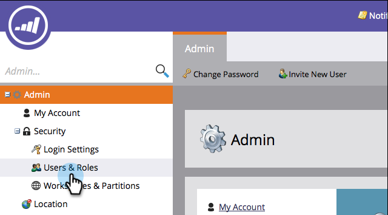

# Exportar uma Lista de usuários e funções {#export-a-list-of-users-and-roles}

>[!NOTE]
>
>**Permissões de administrador necessárias**

É muito fácil exportar uma lista completa de seus usuários e funções de usuário. Veja como.

1. Vá para **Admin**.

   

1. Clique em **Usuários e funções**.

   

1. Adicione/remova as colunas desejadas antes de exportar.

   >[!TIP]
   >
   >Para exportar funções, vá para a guia **Funções******guia primeiro e depois exporte.

   

1. Clique no ícone **Exportar **.

   

   E isso é tudo, pessoal! Você deve estar baixando o novo arquivo Excel.

   

