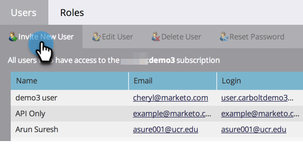
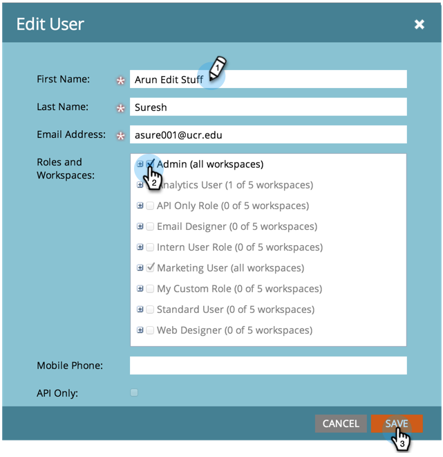

# Gerenciamento de usuários do Marketo {#managing-marketo-users}

>[!IMPORTANT]
>
>Este artigo é apenas para aqueles que _não_ use [Marketo com identidade Adobe](/help/marketo/product-docs/administration/marketo-with-adobe-identity/adobe-identity-management-overview.md){target="_blank"}. Se você fizer isso, siga as etapas em [este artigo](/help/marketo/product-docs/administration/marketo-with-adobe-identity/add-or-remove-a-user.md){target="_blank"}.

## Criar usuários {#create-users}

1. Vá para a **[!UICONTROL Admin]** área.

   

1. Clique em **[!UICONTROL Usuários e funções]**.

   

1. Clique em **[!UICONTROL Convidar novo usuário]**.

   

1. Insira o **[!UICONTROL E-mail]**, **[!UICONTROL Nome]**, e **[!UICONTROL Sobrenome]**.

   

1. Opcionalmente, informe um motivo para o convite e selecione uma data de expiração na **[!UICONTROL O acesso expira em]** usando o seletor de datas.

   

1. Clique em **[!UICONTROL Próxima]**.

   

   >[!TIP]
   >
   >A data de expiração é ótima para participantes externos ou consultores de curto prazo que precisam de acesso à Marketo apenas por um curto período.

   >[!NOTE]
   >
   >Quando a data de expiração chegar, o usuário receberá uma notificação de expiração e sua conta será bloqueada.

1. Selecione o **[!UICONTROL Função]** de sua escolha e clique em **[!UICONTROL Próxima]**.

   

1. Faça edições na mensagem de convite, se necessário. Clique em **Send**.

   

   >[!NOTE]
   >
   >O email/logon precisa ser exclusivo. Se já o tiver usado em uma instância de sandbox, você precisará usar um diferente na produção e vice-versa.

   

   >[!NOTE]
   >
   >Os convites expiram três dias após a adição de um novo usuário.

O novo usuário agora está listado na guia Usuários e receberá um email com instruções sobre como ativar sua conta.

## Excluir usuários {#delete-users}

>[!NOTE]
>
>Se o usuário que você deseja excluir também for um usuário Dynamic Chat, é necessário [remova-os do Dynamic Chat](/help/marketo/product-docs/demand-generation/dynamic-chat/setup-and-configuration/add-or-remove-chat-users.md#remove-a-chat-user){target="_blank"} no Admin Console antes de poder excluí-los no Marketo Engage.

1. Vá para a **[!UICONTROL Admin]** área.

   

1. Clique em **[!UICONTROL Usuários e funções]**.

   

1. Selecione o usuário que deseja remover e clique em **[!UICONTROL Excluir usuário]**.

   

1. Confirme clicando em **[!UICONTROL OK]**.

   

## Redefinir senhas de usuário {#reset-user-passwords}

1. Vá para a **[!UICONTROL Admin]** área.

   

1. Clique em **[!UICONTROL Usuários e funções]**.

   

1. Selecione um usuário e clique em **[!UICONTROL Redefinir senha]**.

   

1. Clique em **[!UICONTROL Fechar]** para descartar o prompt.

   

O usuário receberá um email com instruções de redefinição de senha.

>[!TIP]
>
>Se o usuário não vir o email em sua caixa de entrada, peça que ele verifique sua pasta de lixo eletrônico/spam.

## Alterar permissões e editar informações do usuário {#change-permissions-and-edit-user-information}

1. Vá para a **[!UICONTROL Admin]** área.

   

1. Clique em **[!UICONTROL Usuários e funções]**.

   

1. Selecione um usuário e clique em **[!UICONTROL Editar Usuário]**.

   

1. É possível editar informações de usuário e alterar a função associada. Clique em **[!UICONTROL Salvar]**.

   

>[!CAUTION]
>
>Se você for o único Administrador no Marketo, não remova seus próprios direitos de administrador.

>[!NOTE]
>
>Se um novo usuário for convidado como Administrador, ou se um Administrador for excluído, todos os Administradores atuais receberão uma notificação por email.

Ótimo trabalho! Agora você sabe como criar um usuário, excluir um usuário, redefinir a senha de um usuário e editar usuários.
