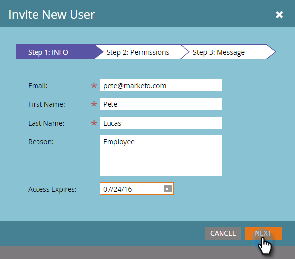

# Gerenciamento de usuários do Marketing {#managing-marketo-users}

## Criar usuários {#create-users}

1. Vá para **Admin** e clique em **Usuários e funções**.

   

1. Clique em **Convidar novo usuário**.

   

1. Insira **Endereço de email**, **Nome** e **Sobrenome. **

   ** 

   **

1. Opcionalmente, informe um motivo para o convite e selecione uma data de expiração no campo **Acesso expira** usando o seletor de datas.

   

1. Clique em **Próximo**.

   

   >[!TIP]
   >
   >Uma data de expiração é excelente para as partes interessadas externas de curto prazo ou consultores que precisam do Marketing para acessar apenas por um breve período de tempo.

   >[!NOTE]
   >
   >Quando a data de expiração chegar, o usuário receberá uma notificação de expiração e sua conta será bloqueada.

1. Selecione a **Função **de sua escolha e clique em **Próximo**.

   

1. Faça edições na mensagem do convite, se necessário. Clique em **Enviar**.

   

   >[!NOTE]
   >
   >O e-mail/login precisa ser exclusivo; se você já o usou em uma instância de caixa de proteção, precisará usar uma diferente em produção e vice-versa.

   

   >[!NOTE]
   >
   >Os convites expiram três dias após a adição de um novo usuário.

O novo usuário agora está listado na guia Usuários e receberá um email com instruções sobre como ativar sua conta.

## Excluir usuários {#delete-users}

1. Vá para Admin e clique em Usuários e funções.

   

1. Selecione o usuário que deseja remover e clique em Excluir usuário.

   

1. Confirme clicando em OK.

   

## Redefinir senhas de usuário {#reset-user-passwords}

1. Vá para Admin e clique em Usuários e funções.

   

1. Selecione um usuário e clique em Redefinir senha.

   

1. Clique em Fechar para fechar o prompt.

   

O usuário receberá um email com instruções de redefinição de senha.

>[!TIP]
>
>Se o usuário não vir o email em sua caixa de entrada, peça para ele verificar a pasta de lixo eletrônico/spam.

## Alterar permissões e editar informações do usuário {#change-permissions-and-edit-user-information}

1. Vá para **Admin** e clique em **Usuários e funções.**

   

1. Selecione um usuário e clique em **Editar usuário**.

   

1. Você pode editar as informações do usuário e alterar a função associada. Clique em **Salvar**.

   

>[!CAUTION]
>
>Se você for o único Administrador no Marketo, certifique-se de não remover seus próprios direitos de administrador.

>[!NOTE]
>
>Se um novo usuário for convidado como Administrador, ou se um Administrador for excluído, todos os Administradores atuais receberão uma notificação por email.

Trabalho incrível! Agora você sabe como criar um usuário, excluir um usuário, redefinir a senha de um usuário e editar usuários.
