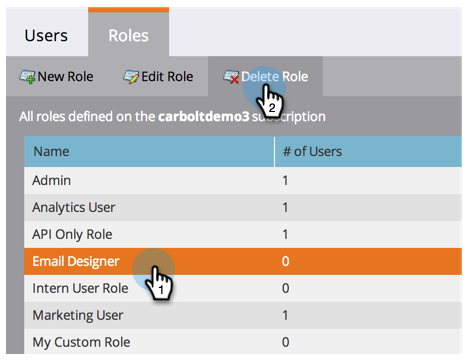

# Gerenciando Funções e Permissões do Usuário {#managing-user-roles-and-permissions}

Defina, crie e edite funções de usuário e as atribua a usuários. Isso permite controlar as áreas e a funcionalidade às quais cada usuário do Marketing tem acesso.

Por exemplo, um usuário de marketing normalmente precisa de amplo acesso em todo o aplicativo, para criar, modificar e implantar emails, landings page e programas. Um web designer, por outro lado, gasta quase todo seu tempo no Design Studio, criando ativos para uso em emails e landings page. E, embora os líderes de empresas façam uso extensivo dos relatórios do Marketo na área do Analytics, talvez eles não precisem criar ou direcionar os próprios ativos ou programas.

>[!NOTE]
>
>**Permissões de administrador necessárias**

O Marketo oferece várias funções incorporadas, com diferentes níveis de acesso:

* **Administrador**  - todas as partes do aplicativo, incluindo a seção Admin
* **Usuário**  padrão - todas as partes do aplicativo, exceto a seção Administrador
* **Usuário**  de marketing - todas as partes do aplicativo, exceto a seção Admin
* **Web Designer**  - somente o Design Studio
* **Usuário**  do Analytics - somente a seção Analytics

Não é possível editar as funções de Administrador e Usuário Padrão, mas é possível editar as outras. Você também pode criar novas funções personalizadas para corresponder às estruturas organizacionais específicas em sua empresa.

## Atribuir Funções a um Usuário {#assign-roles-to-a-user}

Você pode atribuir funções a um usuário ao [criar usuários pela primeira vez](/help/marketo/product-docs/administration/users-and-roles/create-delete-edit-and-change-a-user-role.md) ou ao [editar um usuário existente](/help/marketo/product-docs/administration/users-and-roles/managing-marketo-users.md).

1. Para editar um usuário existente, vá para **Admin** e clique em **Usuários e funções**.

   

1. Na lista, selecione o usuário que deseja editar e clique em **Editar usuário**.

   

1. Em **Funções**, selecione as funções que deseja atribuir ao usuário, com base nas permissões necessárias, e clique em **Salvar**.

   

   >[!NOTE]
   >
   >Para saber mais sobre cada função, consulte [Descrições de permissões de função](/help/marketo/product-docs/administration/users-and-roles/managing-user-roles-and-permissions/descriptions-of-role-permissions.md).

## Criar uma nova função {#create-a-new-role}

Às vezes, sua organização tem funcionários em funções muito específicas que exigem uma combinação personalizada de permissões.

1. Para criar uma nova função de usuário, vá para Admin e clique em **Usuários e funções**.

   

1. Clique na guia **Funções**.

   

1. Clique em **Nova função**.

   

1. Digite um **Nome da função**, um **Descrição** (opcional) e selecione as permissões necessárias para os usuários nesta função.

   

## Editar uma função {#edit-a-role}

Se você precisar alterar as permissões associadas a uma função existente, poderá editar a função.

1. Vá para **Admin** e clique em **Usuários e funções**.

   

1. Clique na guia **Funções**.

   

1. Na lista, selecione a função que deseja modificar e clique em **Editar função**.

   

1. Altere **Nome da Função** e **Descrição**, se necessário, e altere a seleção de **Permissões** associadas.

   

   >[!NOTE]
   >
   >Os usuários que tiverem a função que você editou receberão as permissões modificadas depois que fizerem logout e login novamente.

## Excluir uma função {#delete-a-role}

Se uma função se tornar desnecessária, você poderá excluí-la.

1. Vá para Admin e clique em **Usuários e funções**.

   

1. Clique na guia **Funções**.

   

1. Na lista, selecione a função que deseja excluir e clique em **Excluir função**.

   

1. Clique em **Excluir** para confirmar.

   
