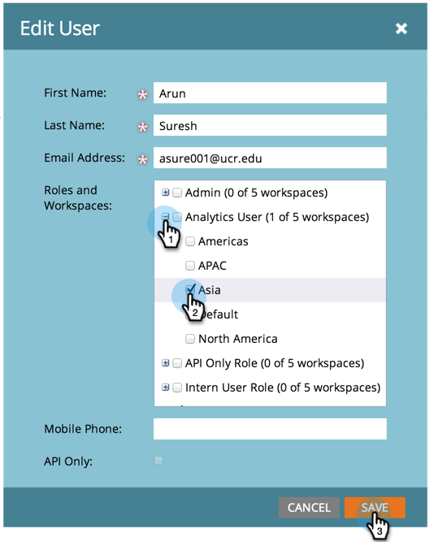

# Gerenciamento de funções e permissões de usuário {#managing-user-roles-and-permissions}

Defina, crie e edite funções de usuário e atribua-as a usuários. Isso permite controlar as áreas e a funcionalidade às quais cada usuário do Marketo tem acesso.

Por exemplo, um usuário de marketing geralmente precisa de amplo acesso ao aplicativo para criar, modificar e implantar emails, landing pages e programas. Um web designer, por outro lado, passa quase todo o tempo no Design Studio, criando ativos para uso em emails e landing pages. E, embora os líderes das empresas façam uso extensivo dos relatórios do Marketo na área do Analytics, talvez não precisem criar ou impulsionar os ativos ou programas.

>[!NOTE]
>
>**Permissões de administrador necessárias**

O Marketo fornece várias funções integradas, com diferentes níveis de acesso:

* **Admin** - todas as partes do aplicativo, incluindo a seção Admin
* **Usuário padrão** - todas as partes do aplicativo, exceto a seção Admin
* **Usuário de marketing** - todas as partes do aplicativo, exceto a seção Admin
* **Web Designer** - apenas o Design Studio
* **Usuário do Analytics** - somente a seção Analytics

Não é possível editar as funções de Administrador e Usuário padrão, mas você pode editar as outras. Você também pode criar novas funções personalizadas para corresponder às estruturas organizacionais específicas da sua empresa.

## Marketo com identidade Adobe {#marketo-with-adobe-identity}

Se estiver usando o Marketo com Adobe Identity, a lista de descrições de perfis [pode ser encontrado aqui](/help/marketo/product-docs/administration/marketo-with-adobe-identity/adobe-identity-management-overview.md#profile-levels).

## Atribuir funções a um usuário {#assign-roles-to-a-user}

Você pode atribuir funções a um usuário quando [criar usuários pela primeira vez](/help/marketo/product-docs/administration/users-and-roles/create-delete-edit-and-change-a-user-role.md) ou por [editar um usuário existente](/help/marketo/product-docs/administration/users-and-roles/managing-marketo-users.md).

1. Vá para a **[!UICONTROL Admin]** área.

   

1. Clique em **[!UICONTROL Usuários e funções]**.

   

1. Na lista, selecione o usuário que deseja editar e clique em **[!UICONTROL Editar Usuário]**.

   

1. Em **[!UICONTROL Funções]**, selecione as funções que deseja atribuir ao usuário com base nas permissões necessárias e clique em **[!UICONTROL Salvar]**.

   

   >[!NOTE]
   >
   >Para saber mais sobre cada função, consulte [Descrições de permissões de função](/help/marketo/product-docs/administration/users-and-roles/descriptions-of-role-permissions.md).

## Criar uma nova função {#create-a-new-role}

Às vezes, sua organização tem funcionários em funções muito específicas que exigem uma combinação personalizada de permissões.

1. Vá para a **[!UICONTROL Admin]** área.

   

1. Clique em **[!UICONTROL Usuários e funções]**.

   

1. Clique em **[!UICONTROL Funções]** guia.

   

1. Clique em **[!UICONTROL Nova Função]**.

   

1. Insira um **[!UICONTROL Nome da função]**, um **[!UICONTROL Descrição]** (opcional) e selecione as permissões que os usuários nesta função precisarão.

   

## Editar uma função {#edit-a-role}

Se você precisar alterar as permissões associadas a uma função existente, edite a função.

1. Vá para a **[!UICONTROL Admin]** área.

   

1. Clique em **[!UICONTROL Usuários e funções]**.

   

1. Clique em **[!UICONTROL Funções]** guia.

   

1. Na lista, selecione a função que deseja modificar e clique em **[!UICONTROL Editar Função]**.

   

1. Altere o **[!UICONTROL Nome da função]** e **[!UICONTROL Descrição]** se necessário, e altere a seleção de associados **[!UICONTROL Permissões]**.

   

   >[!NOTE]
   >
   >Os usuários que tiverem a função editada receberão as permissões modificadas depois que fizerem logoff e entrarem novamente.

## Excluir uma função {#delete-a-role}

Se uma função se tornar desnecessária, você poderá excluí-la.

1. Vá para a **[!UICONTROL Admin]** área.

   

1. Clique em **[!UICONTROL Usuários e funções]**.

   

1. Clique em **[!UICONTROL Funções]** guia.

   

1. Na lista, selecione a função que deseja excluir e clique em **[!UICONTROL Excluir Função]**.

   

1. Clique em **[!UICONTROL Excluir]** para confirmar.

   
