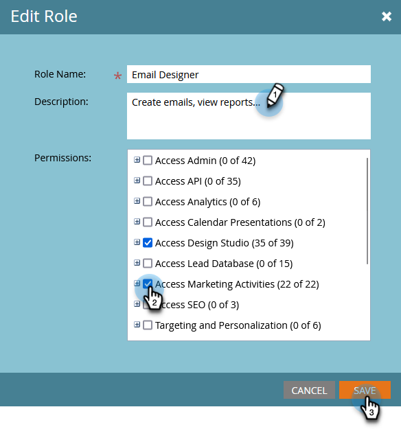

# Gerenciando funções e permissões do usuário {#managing-user-roles-and-permissions}

Defina, crie e edite funções de usuário e as atribua a usuários. Isso permite controlar as áreas e a funcionalidade às quais cada usuário do Marketo tem acesso.

Por exemplo, um usuário de marketing normalmente precisa de amplo acesso no aplicativo, para criar, modificar e implantar emails, landing pages e programas. Um web designer, por outro lado, gasta quase todo o tempo no Design Studio, criando ativos para uso em emails e landing pages. E embora os líderes das empresas façam uso extensivo dos relatórios da Marketo na área do Analytics, talvez não precisem criar ou conduzir os próprios ativos ou programas.

>[!NOTE]
>
>**Permissões de administrador necessárias**

O Marketo fornece várias funções integradas, com diferentes níveis de acesso:

* **Administrador** - todas as partes do aplicativo, incluindo a seção Admin
* **Usuário padrão** - todas as partes do aplicativo, exceto a seção Admin
* **Usuário de marketing** - todas as partes do aplicativo, exceto a seção Admin
* **Designer da Web** - apenas o Design Studio
* **Usuário do Analytics** - somente a seção Analytics

Não é possível editar as funções Administrador e Usuário padrão, mas você pode editar as outras. Você também pode criar novas funções personalizadas para corresponder às estruturas organizacionais específicas em sua empresa.

## Marketo com Adobe Identity {#marketo-with-adobe-identity}

Se estiver usando o Marketo com Adobe Identity, a lista de descrições do perfil [pode ser encontrada aqui](/help/marketo/product-docs/administration/marketo-with-adobe-identity/adobe-identity-management-overview.md#profile-levels).

## Atribuir funções a um usuário {#assign-roles-to-a-user}

Você pode atribuir funções a um usuário ao [criar usuários pela primeira vez](/help/marketo/product-docs/administration/users-and-roles/create-delete-edit-and-change-a-user-role.md) ou [editar um usuário existente](/help/marketo/product-docs/administration/users-and-roles/managing-marketo-users.md).

1. Vá para o **Administrador** área.

   

1. Clique em **Usuários e funções**.

   

1. Na lista, selecione o usuário que deseja editar e clique em **Editar usuário**.

   

1. Em **Funções**, selecione as funções que deseja atribuir ao usuário com base nas permissões necessárias e clique em **Salvar**.

   

   >[!NOTE]
   >
   >Para saber mais sobre cada função, consulte  [Descrições das permissões de função](/help/marketo/product-docs/administration/users-and-roles/managing-user-roles-and-permissions/descriptions-of-role-permissions.md).

## Criar uma nova função {#create-a-new-role}

Às vezes, sua organização tem funcionários em funções muito específicas que exigem uma combinação personalizada de permissões.

1. Vá para o **Administrador** área.

   

1. Clique em **Usuários e funções**.

   

1. Clique no botão **Funções** guia .

   

1. Clique em **Nova função**.

   

1. Insira um **Nome da função**, a **Descrição** (opcional) e selecione as permissões necessárias para os usuários nessa função.

   

## Editar uma função {#edit-a-role}

Se precisar alterar as permissões associadas a uma função existente, edite a função.

1. Vá para o **Administrador** área.

   

1. Clique em **Usuários e funções**.

   

1. Clique no botão **Funções** guia .

   

1. Na lista , selecione a função que deseja modificar e clique em **Editar função**.

   

1. Altere o **Nome da função** e **Descrição** se necessário e, em seguida, altere a seleção de **Permissões**.

   

   >[!NOTE]
   >
   >Os usuários que tiverem a função que você editou receberão as permissões modificadas depois de desconectarem e entrarem novamente.

## Excluir uma função {#delete-a-role}

Se uma função se tornar desnecessária, você poderá excluí-la.

1. Vá para o **Administrador** área.

   

1. Clique em **Usuários e funções**.

   

1. Clique no botão **Funções** guia .

   

1. Na lista, selecione a função que deseja excluir e clique em **Excluir função**.

   

1. Clique em **Excluir** para confirmar.

   
