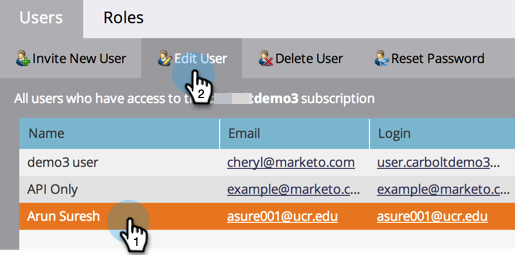

# Permitir acesso do usuário a uma Workspace {#allow-user-access-to-a-workspace}

Os espaços de trabalho podem ser usados por qualquer motivo (como separação de unidades de negócios ou geografia). Eles separam os ativos (listas inteligentes, programas etc.) de cada equipe. Veja como conceder a um usuário acesso a um ou mais espaços de trabalho.

>[!NOTE]
>
>**Permissões de administrador necessárias**

>[!NOTE]
>
>Saiba mais sobre [espaços de trabalho](/help/marketo/product-docs/administration/workspaces-and-person-partitions/understanding-workspaces-and-person-partitions.md).

1. Vá para a área **[!UICONTROL Administrador]**.

   

1. Clique em **[!UICONTROL Usuários e funções]**.

   

1. Na guia **[!UICONTROL Usuários]**, selecione o usuário e clique em **[!UICONTROL Editar Usuário]**.

   

1. Selecione as **[!UICONTROL Funções e Espaços de Trabalho]** às quais você deseja que o usuário tenha acesso.

   

   >[!NOTE]
   >
   >Você pode permitir que seus usuários tenham qualquer combinação de acesso aos espaços de trabalho.

Depois de salvar as alterações, você deverá ver a atualização.

