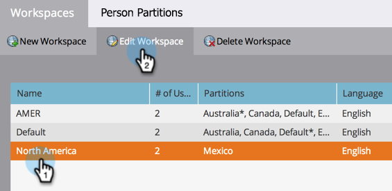

# Atribuir partições de pessoa a espaços de trabalho {#assign-person-partitions-to-workspaces}

Veja como editar a partição de pessoa/atribuições de espaço de trabalho:

>[!NOTE]
>
>**Permissões de administrador necessárias**

>[!PREREQUISITES]
>
>[Criar um Novo Workspace](/help/marketo/product-docs/administration/workspaces-and-person-partitions/create-a-new-workspace.md){target="_blank"}

>[!CAUTION]
>
>Os espaços de trabalho e as partições de pessoas podem ser complexos. Contate o [suporte da Marketo](https://nation.marketo.com/t5/Support/ct-p/Support){target="_blank"} para obter ajuda sobre como configurá-los.

1. Vá para a área **[!UICONTROL Administrador]**.

   

1. Clique em **[!UICONTROL Espaços de trabalho e partições]**.

   

1. Selecione seu espaço de trabalho e clique em **[!UICONTROL Editar Workspace]**.

   

1. Edite as informações de partição de pessoa que deseja alterar.

   

   >[!NOTE]
   >
   >* A caixa de seleção &quot;[!UICONTROL Todas as Partições de Pessoa]&quot; indica que este espaço de trabalho tem acesso a todas as partições de pessoas no sistema.
   >
   >* As partições primárias de pessoas são o padrão em que todas as pessoas são inseridas. Use [etapas de fluxo](/help/marketo/product-docs/core-marketo-concepts/smart-campaigns/flow-actions/use-add-choice-in-a-flow-step.md) ou [regras de atribuição](/help/marketo/product-docs/administration/workspaces-and-person-partitions/assigning-person-partitions-with-assignment-rules.md){target="_blank"} para mover pessoas.

1. Clique em **[!UICONTROL Salvar]**.

   

Depois de salvar, você deve ver as alterações.

Você editou seu espaço de trabalho com êxito!

>[!MORELIKETHIS]
>
>[Compreendendo os Espaços de Trabalho e as Partições de Pessoa](/help/marketo/product-docs/administration/workspaces-and-person-partitions/understanding-workspaces-and-person-partitions.md){target="_blank"}.
