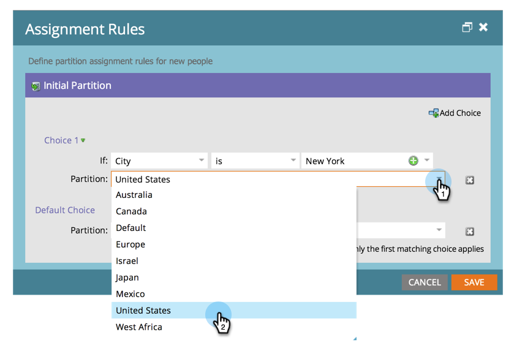

# Atribuindo Partições de Pessoa com Regras de Atribuição {#assigning-person-partitions-with-assignment-rules}

>[!NOTE]
>
>**Permissões de administrador necessárias**

>[!PREREQUISITES]
>
>[Criar uma Partição de Pessoa](/help/marketo/product-docs/administration/workspaces-and-person-partitions/create-a-person-partition.md)

Ao usar partições de pessoa, configure regras de atribuição para rotear as pessoas criadas pelo seu CRM para suas respectivas partições.

>[!NOTE]
>
>Somente as pessoas criadas no Marketo a partir do seu CRM e por meio da API SOAP terão regras de atribuição aplicadas a elas.

1. Vá para a área **[!UICONTROL Administrador]**.

   

1. Clique em **[!UICONTROL Espaços de trabalho e partições]**.

   

1. Na guia **[!UICONTROL Partições de pessoa]**, clique em **[!UICONTROL Regras de atribuição]**.

   

1. Clique em **[!UICONTROL Adicionar opção]** para adicionar condições para rotear pessoas para partições de pessoas.

   

1. Selecione o campo no qual a condição deve ser criada.

   

1. Escolha o operador e insira um valor.

   

1. Selecione a Partição de Pessoas na qual você deseja que as pessoas que atendem às condições se encaixem.

   

   >[!NOTE]
   >
   >Você pode adicionar quantas escolhas desejar.

1. Clique em **[!UICONTROL Salvar]**.

   

E aí está! Você atribuiu regras para preencher as partições da sua pessoa com pessoas!

>[!NOTE]
>
>A opção padrão será aplicada se nenhuma das condições anteriores for atendida.
