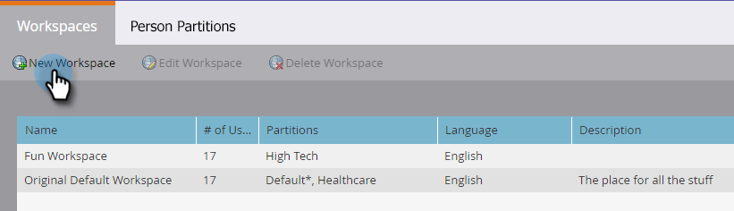

# Criar um novo espaço de trabalho {#create-a-new-workspace}

Os espaços de trabalho são úteis para subdividir sua empresa. Os motivos para configurar espaços de trabalho incluem:

* Geografia: Operações de marketing na Europa vs. Operações de marketing na América do Norte
* Unidade de negócio A vs. Unidade de negócio B

Veja como criar um novo espaço de trabalho.

>[!NOTE]
>
>**Permissões de administrador necessárias**

>[!NOTE]
>
>Compreenda primeiro com [Compreensão de espaços de trabalho e partições pessoais](/help/marketo/product-docs/administration/workspaces-and-person-partitions/understanding-workspaces-and-person-partitions.md).

>[!NOTE]
>
>Para saber mais sobre as práticas recomendadas do Workspace, entre em contato com [Serviços profissionais do Marketing](mailto:services@marketo.com).

1. Em **Admin**, clique em **Espaços de trabalho e partições**.

   

1. Clique em **Nova Workspace**.

   

1. Insira um **Nome** e selecione as **Partições de Pessoas** que pretende utilizar. Escolha uma **Partição de Pessoa Principal**.

   >[!NOTE]
   >
   >Certifique-se de [criar partições de pessoa](/help/marketo/product-docs/administration/workspaces-and-person-partitions/create-a-person-partition.md), caso ainda não o tenha feito.

   

   >[!NOTE]
   >
   >A caixa de seleção **Todas as partições de pessoa** significa que essa área de trabalho pode usar todas as partições de pessoa no sistema.
   >
   >A partição **pessoa principal** atua como padrão e é onde todas as pessoas serão atribuídas.

   Se você ativou vários domínios de marca, é necessário escolher um domínio de marca primária.

   

1. Selecione o idioma do espaço de trabalho.

   >[!NOTE]
   >
   >Após a criação, o Marketo implantará ativos de amostra no espaço de trabalho. A linguagem permite que esses objetos semeados estejam em um idioma diferente do inglês.

   

1. Clique em **Criar**.

   

   Crie quantos espaços de trabalho forem necessários e atribua a(s) partição(ões) de pessoa adequada(s) a eles.

   Depois de criar o espaço de trabalho, você deve ver a atualização!

   
