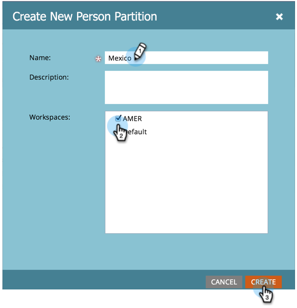

# Criar uma partição de pessoa {#create-a-person-partition}

Crie uma nova partição de pessoa seguindo essas etapas.

>[!NOTE]
>
>**Permissões de administrador são necessárias**

>[!NOTE]
>
>Entenda primeiro com [Entendendo os Espaços de Trabalho e as Partições de Pessoa](/help/marketo/product-docs/administration/workspaces-and-person-partitions/understanding-workspaces-and-person-partitions.md).

1. Vá para a área **[!UICONTROL Administrador]**.

   

1. Clique em **[!UICONTROL Espaços de trabalho e partições]**.

   

1. Vá para a guia **[!UICONTROL Partições de pessoa]** e clique em **[!UICONTROL Nova Partição de Pessoa]**.

   

1. Nomeie sua partição, escolha os **[!UICONTROL Espaços de Trabalho]** onde ela aparecerá e clique em **[!UICONTROL Criar]**.

   

Depois de criar a partição, você deve ver a atualização.

