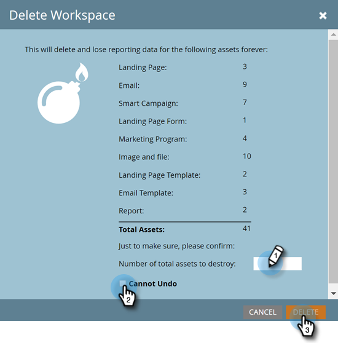

# Excluir um espaço de trabalho {#delete-a-workspace}

>[!NOTE]
>
>**Permissões de administrador são necessárias**

>[!NOTE]
>
>Não é possível excluir o espaço de trabalho padrão no Marketo.

1. Vá para a área **[!UICONTROL Administrador]**.

   

1. Clique em **[!UICONTROL Espaços de trabalho e partições]**.

   

1. Selecione um espaço de trabalho e clique em **[!UICONTROL Excluir Workspace]**.

   

1. Confirme o número de ativos a serem excluídos (listados ao lado de &quot;[!UICONTROL total de ativos]&quot;), marque a caixa de seleção **[!UICONTROL Não é possível desfazer]** e clique em **[!UICONTROL Excluir]**.

   
