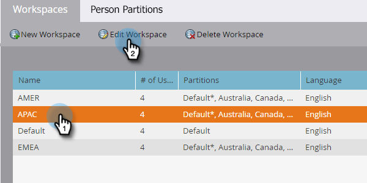

# Editar um espaço de trabalho {#edit-a-workspace}

Às vezes, é necessário fazer alterações em uma Workspace.

>[!NOTE]
>
>**Permissões de administrador são necessárias**

>[!NOTE]
>
>Para obter mais informações sobre espaços de trabalho, consulte [Noções básicas sobre espaços de trabalho e partições de pessoas](/help/marketo/product-docs/administration/workspaces-and-person-partitions/understanding-workspaces-and-person-partitions.md){target="_blank"}.

1. Vá para a área **[!UICONTROL Administrador]**.

   

1. Clique em **[!UICONTROL Espaços de trabalho e partições]**.

   

1. Selecione o espaço de trabalho que deseja editar e clique em **[!UICONTROL Editar Workspace]**.

   

1. Você pode selecionar uma partição de lead diferente e escolher uma partição de pessoa principal diferente na lista suspensa.

   >[!NOTE]
   >
   >Você pode [criar mais partições de pessoas](/help/marketo/product-docs/administration/workspaces-and-person-partitions/create-a-person-partition.md){target="_blank"} se precisar delas.

   

   >[!NOTE]
   >
   >A caixa de seleção **[!UICONTROL Todas as Partições de Pessoa]** significa que este espaço de trabalho pode usar todas as partições de cliente potencial no sistema.

   >[!NOTE]
   >
   >A **[!UICONTROL Partição de Pessoa Principal]** atua como padrão e é onde todas as pessoas serão atribuídas.

   Se você ativou vários domínios com marca, é possível alterá-los para um domínio com marca primária diferente. Clique em **[!UICONTROL Salvar]**.

   

   >[!NOTE]
   >
   >O idioma do espaço de trabalho não pode ser alterado.

>[!MORELIKETHIS]
>
>* [Criar um Novo Workspace](/help/marketo/product-docs/administration/workspaces-and-person-partitions/create-a-new-workspace.md){target="_blank"}
>* [Noções básicas sobre espaços de trabalho e partições de pessoas](/help/marketo/product-docs/administration/workspaces-and-person-partitions/understanding-workspaces-and-person-partitions.md){target="_blank"}
