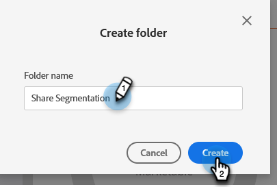
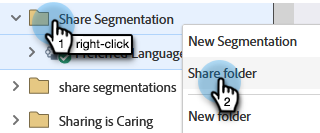

# Noções básicas dos espaços de trabalho e partições de pessoas {#understanding-workspaces-and-person-partitions}

## Áreas de trabalho {#workspaces}

>[!CAUTION]
>
>Os espaços de trabalho podem ser complexos de configurar. Entre em contato com o [Suporte do Marketo](https://nation.marketo.com/t5/Support/ct-p/Support) para saber se são adequados para você.

Os espaços de trabalho são áreas separadas no Marketo que contêm ativos de marketing, como programas, páginas de destino, emails e muito mais. Eles podem ser usados por várias pessoas. Cada usuário tem acesso a um ou mais espaços de trabalho.

>[!NOTE]
>
>**Exemplo**
>
>Alguns motivos para querer usar um espaço de trabalho:
>
>* Geografia: os departamentos de marketing da Europa, Ásia e América do Norte recebem um espaço de trabalho cada
>* Unidade de negócios: [!DNL Quicken], [!DNL Quickbooks] e [!DNL TurboTax] recebem um espaço de trabalho cada
>
>Em cada caso, a separação ocorre porque os ativos de marketing são completamente diferentes. Caso eles compartilhem ativos de marketing, os espaços de trabalho podem não ser a ferramenta certa para você.

>[!NOTE]
>
>Saiba como [criar um novo espaço de trabalho](/help/marketo/product-docs/administration/workspaces-and-person-partitions/create-a-new-workspace.md).

## Compartilhamento entre espaços de trabalho {#sharing-across-workspaces}

Confira abaixo como compartilhar ativos entre espaços de trabalho. Funciona da mesma forma para qualquer item que você queira compartilhar. Este exemplo mostra segmentações.

>[!NOTE]
>
>A pasta principal que contém os seus ativos é a única pasta que pode ser compartilhada, não as pastas secundárias.

1. Clique em **[!UICONTROL Banco de dados]**.

   

1. Clique com o botão direito do mouse na pasta “Segmentação” e selecione **[!UICONTROL Nova pasta]**.

   

1. Nomeie a pasta e clique em **[!UICONTROL Criar]**.

   

1. Mova os ativos que deseja compartilhar para a pasta.

   

1. Clique com o botão direito do mouse na pasta e selecione **[!UICONTROL Compartilhar pasta]**.

   

1. Selecione os espaços de trabalho com os quais deseja compartilhar a pasta e clique em **[!UICONTROL Salvar]**. A caixa de diálogo “Compartilhar pasta” exibirá somente os espaços de trabalho que você tem permissão para visualizar.

   

   >[!NOTE]
   >
   >Agora, a pasta de origem mostrará uma pequena seta verde, indicando que foi compartilhada. No espaço de trabalho compartilhado, a pasta mostrará um cadeado, indicando que é somente de leitura.

Você pode compartilhar esses itens entre espaços de trabalho.

* Modelos de email
* Modelos de páginas de destino
* Modelos
* Campanhas inteligentes
* [Listas inteligentes](/help/marketo/product-docs/core-marketo-concepts/smart-lists-and-static-lists/using-smart-lists/reference-a-list-or-smart-list-across-workspaces.md)
* [Segmentações](/help/marketo/product-docs/administration/workspaces-and-person-partitions/share-segmentations-across-workspaces-and-partitions.md)
* Trechos

## Clonagem entre espaços de trabalho {#cloning-across-workspaces}

Para ativos que não são modelos, é melhor cloná-los como ativos locais dentro de um programa. Com o nível de acesso apropriado, você pode arrastar e soltar esses ativos em outro espaço de trabalho:

* Programas
* Emails
* Páginas de destino
* Formulários

>[!IMPORTANT]
>
>Embora todos os itens listados acima possam ser clonados entre espaços de trabalho, emails, formulários e páginas de destino _precisam estar dentro de um programa_ no momento da clonagem.

>[!NOTE]
>
>Ao clonar ativos que possuem modelos, esses modelos precisam ser compartilhados com o espaço de trabalho de destino.

## Mover ativos para outros espaços de trabalho {#moving-assets-to-other-workspaces}

Para mover ativos para um novo espaço de trabalho, coloque-os em uma pasta e arraste-a para outro espaço de trabalho.

>[!NOTE]
>
>Você não pode mover um programa que contenha membros de um espaço de trabalho para outro.

## Partições de pessoas {#person-partitions}

As partições de pessoas atuam como bancos de dados separados. Cada partição tem suas próprias pessoas, que não são desduplicadas nem combinadas com outras partições. Se você achar que tem um caso de uso comercial que pode exigir registros duplicados com o mesmo endereço de email, entre em contato com o [Suporte do Marketo](https://nation.marketo.com/t5/Support/ct-p/Support).

Você pode atribuir partições de pessoas a [espaços de trabalho](create-a-new-workspace.md) nas seguintes configurações:

* um espaço de trabalho para uma partição de pessoa (1:1)
* um espaço de trabalho para muitas partições de pessoas (1:x)
* muitos espaços de trabalho para uma partição de pessoa (x:1)

>[!NOTE]
>
>Motivos para usar uma partição de pessoa:
>
>* Os seus espaços de trabalho, além de ter ativos diferentes, também não compartilham nenhuma pessoa
>* Você quer fazer duplicações por outros motivos comerciais

>[!CAUTION]
>
>As partições de pessoas não interagem entre si, portanto, tenha cuidado ao configurá-las.

>[!NOTE]
>
>Saiba como [criar uma partição de pessoa](/help/marketo/product-docs/administration/workspaces-and-person-partitions/create-a-person-partition.md).
