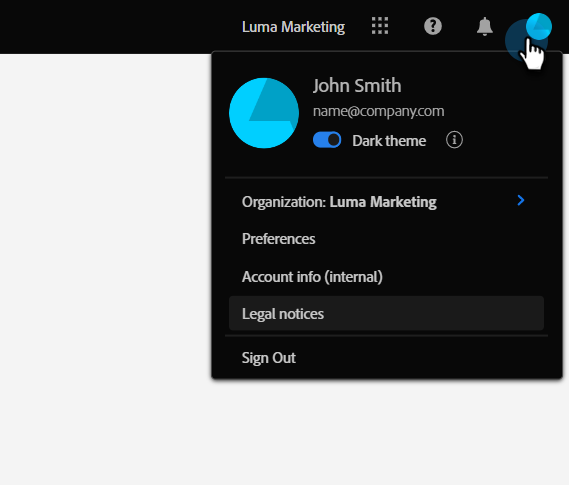

# Visão geral da interface da Adobe Experience Cloud {#adobe-experience-cloud-interface-overview}

A interface da Adobe Experience Cloud alinha a aparência do ambiente (shell) dos aplicativos e serviços da Adobe Experience Cloud. Mas isso é mais do que apenas um novo design. É um aplicativo de página única que oferece experiência de usuário em uma única instância.

## Fluxo de usuário {#user-flow}

Se você ainda não tiver feito logon em um produto da Adobe Experience Cloud, faça logon diretamente no [!DNL Marketo Engage] usando este link: [https://experience.adobe.com/marketo-engage](https://experience.adobe.com/marketo-engage).

Se você _já tiver_ feito logon em um produto da Adobe Experience Cloud, basta clicar no ícone de menu e selecionar **[!DNL Marketo Engage]**.

>[!NOTE]
>
>O menu suspenso pode ter uma aparência diferente dependendo dos produtos da Adobe Experience Cloud nos quais você está inscrito.

## Novos recursos {#new-features}

Além da aparência atualizada, você notará os seguintes recursos:

**Central de ajuda integrada**

Acesse uma variedade de recursos de ajuda disponíveis no aplicativo [!DNL Marketo Engage].

**Alternador de aplicativos**

Usuários que tem acesso a vários produtos da Adobe poderão alternar facilmente entre eles.

**Notificações e anúncios**

Visualize e interaja com notificações específicas e anúncios gerais de produtos da Adobe diretamente no aplicativo.

**Configurações da Adobe**

Clique no ícone do seu perfil para alterar o idioma ou outras preferências da Adobe.

## Perguntas frequentes {#faq}

**Não consigo fazer logon no [!DNL Marketo Engage] por meio da interface da Experience Cloud. Qual pode ser o problema?**

Se você conseguir fazer logon na Adobe Experience Cloud, mas vir o erro “Falha ao carregar página”, o problema pode estar no [!DNL Marketo Engage]. Entre em contato com o [suporte do Marketo](https://nation.marketo.com/t5/support/ct-p/Support) para obter assistência.

**Para onde foi o Histórico do usuário, a Pesquisa global, as notificações do Marketo e a Bandeja de tarefas?**

Esses recursos foram movidos da barra de navegação superior para uma nova barra no lado esquerdo da interface da Experience Cloud.

