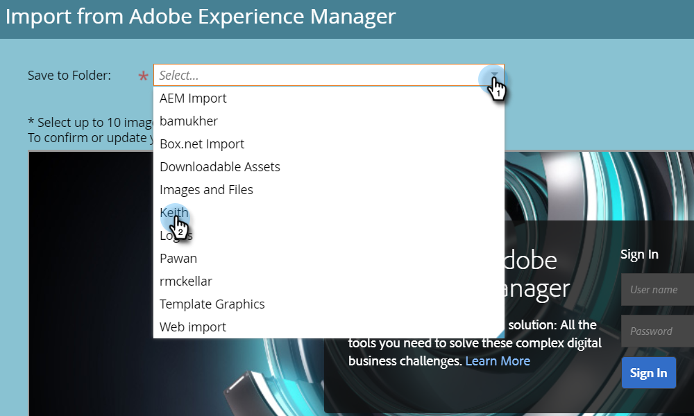

# Importação de ativos com o Adobe Experience Manager {#importing-assets-with-adobe-experience-manager}

O Seletor de ativos permite que os clientes do Marketo acessem, selecionem e importem ativos do AEM para o Marketo [!DNL Design Studio]. **Permissões de administrador necessárias**.

>[!AVAILABILITY]
>
>Nem todos compraram este recurso. Entre em contato com a equipe de conta da Adobe (seu gerente de conta) para obter mais detalhes.

>[!PREREQUISITES]
>
>Verifique se você já executou a [Configuração do AEM](/help/marketo/product-docs/core-marketo-concepts/miscellaneous/configuring-adobe-experience-manager-integration.md).

>[!IMPORTANT]
>
>Atualmente, este recurso só tem suporte total no [!DNL Firefox]. Não há suporte no [!DNL Safari], e ele pode não funcionar na versão mais recente do [!DNL Chrome], dependendo das suas configurações de cookie do [!DNL SameSite].

1. Clique em **[!UICONTROL Design Studio]**.

   

1. Clique no menu suspenso Novo e selecione **[!UICONTROL Importar do Adobe Experience Manager]**.

   

1. Escolha a pasta onde as imagens serão salvas.

   

1. Faça logon no Adobe Experience Manager (caso ainda não o tenha feito).

   

1. Escolha sua pasta. Em seguida, selecione as imagens desejadas clicando na miniatura (é possível escolher até 10). Clique em **[!UICONTROL Selecionar]** quando terminar.

   

   >[!NOTE]
   >
   >As imagens não podem exceder o tamanho de 100 MB.

1. Clique em **[!UICONTROL Importar]** para concluir o processo.

   

   E é isso! Clique em **[!UICONTROL Fechar]** para retornar ao Design Studio.

   

## Itens a Observar {#things-to-note}

* Atualmente, o Marketo é compatível com o Adobe Experience Manager versões 6.4 e 6.5.

* Todos os usuários na sua instância poderão exibir/acessar as imagens importadas.

* As imagens não são atualizadas automaticamente. Se uma imagem importada para o Marketo [!DNL Design Studio] for atualizada no AEM, você deverá reimportá-la manualmente para o Marketo.
