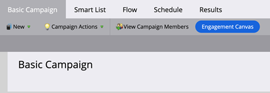

# Visão geral do mapa de engajamento {#engagement-map-overview}

O Mapa de engajamento permite visualizar intuitivamente suas Campanhas inteligentes. Ele oferece total compatibilidade com versões anteriores de todas as Campanhas inteligentes da Marketo Engage existentes, sem a perda de recursos atuais.

>[!NOTE]
>
>O Mapa de engajamento está disponível atualmente em Campanhas inteligentes. Não está disponível em Programas.

## Acesso ao Mapa de engajamento {#accessing-engagement-map}

Navegue até qualquer campanha existente e clique no botão **Mapa de Envolvimento**.

No Mapa de Envolvimento, há duas guias: [Mapa de Envolvimento](/help/marketo/product-docs/core-marketo-concepts/engagement-map/engagement-map-tab.md){target="_blank"} e [Configurações](/help/marketo/product-docs/core-marketo-concepts/engagement-map/settings-tab.md){target="_blank"}.

## Descrições do cartão {#card-descriptions}

**Triggers**: em campanhas que incluem acionadores, o mapa tem um cartão &quot;Visão geral do acionador&quot;. Clicar nesse ícone revelará um cartão para cada acionador, bem como um painel deslizante com informações adicionais.

**Filtros**: em campanhas que incluem filtros, o mapa contém um cartão de Visão Geral de Filtro. Clicar nele revela um painel deslizante com informações adicionais sobre cada filtro.

**Etapas de Fluxo**: cada campanha inclui um cartão para cada etapa de fluxo. Clicar neles revelará um painel deslizante com informações adicionais.

**Opções**: se uma etapa de fluxo incluir uma ou mais opções, clicar no cartão de fluxo revelará um cartão para cada escolha, bem como um painel deslizante com informações adicionais.

## Campanhas aninhadas {#nested-campaigns}

* Se uma campanha incluir uma etapa de fluxo Solicitar ou Executar Campanha, clicar no cartão de fluxo mostrará detalhes da campanha que está sendo chamada, bem como um painel deslizante com informações adicionais.

* Se uma campanha incluir uma etapa do fluxo Solicitar ou Executar Campanha com opções, clicar no cartão de fluxo mostrará um cartão para cada escolha, bem como um painel deslizante com mais informações sobre as opções. Clicar em cada cartão de opção mostra detalhes da campanha que está sendo chamada, bem como um painel deslizante com mais informações.

* Além disso, se qualquer uma das campanhas aninhadas tiver uma etapa de fluxo Solicitar ou Executar Campanha, clicar no cartão de fluxo mostrará detalhes da campanha. O mesmo é aplicável quando a etapa do fluxo inclui opções.

## Navegação superior {#top-navigation}

A navegação superior inclui os seguintes recursos:

* Nome da campanha e acesso à modal &quot;Editar campanha&quot;, você pode editar o nome e a descrição da campanha aqui.

* O status e o tipo da campanha serão refletidos abaixo do nome

* Botão Ativar/Desativar para acionar campanhas

* Editar lista inteligente - Você será direcionado para a interface da lista inteligente em uma nova guia, na qual poderá adicionar ou editar filtros e/ou acionadores

* Editar fluxo - você será direcionado para a interface Fluxo em uma nova guia, na qual poderá adicionar ou editar suas Etapas de fluxo

* Exportar — baixa uma imagem da visualização da campanha. A versão baixada reflete todas as ramificações expandidas

* Exibir Membros da Campanha - Isso abrirá uma nova guia com detalhes do Membro da Campanha.

>[!NOTE]
>
>As alterações feitas em uma guia Smart List e Fluxo aberta serão refletidas na guia Mapa de engajamento após a atualização. Ele não será atualizado automaticamente. As atualizações e edições salvas automaticamente serão refletidas na atualização da guia Mapa de engajamento.

## Perguntas frequentes {#faq}

**Preciso reconstruir todas as minhas campanhas no Mapa de Envolvimento?**

Não. O Mapa de engajamento tem compatibilidade total com versões anteriores. Com apenas um clique, você poderá ver cada uma de suas campanhas existentes na interface visual do Mapa de engajamento.

**Ter o Mapa de Envolvimento no Marketo Engage significa que perderei o acesso à estrutura de pastas e precisarei reaprender a criar uma Campanha Inteligente?**

Não. O melhor do mapa de engajamento é que ele oferece o melhor dos dois mundos; complementa a maneira atual de criar campanhas. Todos os usuários ainda obterão o poderoso conjunto de recursos do Marketo Engage, agora complementado por visuais claros.

**O Mapa de Envolvimentos é um complemento pago?**

Não. Todos os usuários existentes e novos do Marketo Engage em todas as assinaturas terão acesso a esse recurso complementar.

**Como administrador do Marketo Engage, sou responsável por ativar/desativar o Mapa de Envolvimento?**

Não. O Mapa de engajamento estará disponível para todos os usuários em suas instâncias. Você não poderá ativá-lo/desativá-lo para determinados usuários, espaços de trabalho, etc.

**Qual é a diferença em relação aos outros construtores visuais?**

Há três itens principais que destacam o Mapa de engajamento:

* Flexibilidade: gerencie e valide facilmente campanhas interconectadas ou profundamente aninhadas com visualização.

* Funcionalidade: todos os visuais estão prontos para uso, facilitando sua utilização; a estrutura aninhada permite que você mergulhe e obtenha a imagem completa.

* Potência: você mantém toda a sofisticação existente do Marketo Engage, agora em um formato visual.

>[!MORELIKETHIS]
>
>* [Guia de Mapa de Envolvimento](/help/marketo/product-docs/core-marketo-concepts/engagement-map/engagement-map-tab.md){target="_blank"}
>* [Guia Configurações](/help/marketo/product-docs/core-marketo-concepts/engagement-map/settings-tab.md){target="_blank"}
