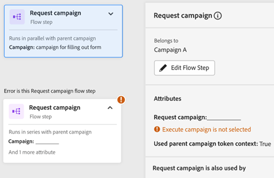

# Guia Mapa de engajamento {#engagement-map-tab}

O Mapa de engajamento é representado por meio de uma série de acionadores, filtros e cartões de fluxo. Clicar em cada cartão revelará informações adicionais.

Visão geral do acionador: este cartão mostra o número de acionadores em sua campanha. Clicar nele revelará um cartão para cada acionador, bem como um painel deslizante com as seguintes informações:

* Campanha à qual o acionador pertence
* Lista de nomes de acionadores
* Botão &quot;Editar acionador&quot;

  

Trigger Detail: esse cartão mostra o nome do acionador. Ao clicar nele, um painel deslizante será exibido com as seguintes informações:

* Campanha à qual o acionador pertence
* Lista de restrições associadas ao acionador
* Botão &quot;Editar acionador&quot;

  

Filtro: ao clicar neste cartão, será exibido um painel deslizante com as seguintes informações:

* Campanha à qual o acionador pertence
* Número estimado de pessoas qualificadas para o filtro
* Lista de filtros e suas respectivas restrições
* Botão &quot;Editar filtro&quot;

  

Etapas de fluxo: Se uma etapa de fluxo incluir opções, este cartão mostrará o nome da etapa de fluxo. Ao clicar nele, um painel deslizante será exibido com as seguintes informações:

* Campanha à qual a etapa de Fluxo pertence
* Lista de condições de escolha associadas à etapa do fluxo
* Botão &quot;Editar fluxo&quot;

  

Etapas de fluxo: se uma etapa de fluxo não _não_ inclua quaisquer opções, este cartão mostrará os atributos associados à etapa do fluxo. Ao clicar nele, um painel deslizante será exibido com as seguintes informações:

* Campanha à qual a etapa de Fluxo pertence
* Lista de atributos associados à etapa do fluxo
* Botão &quot;Editar fluxo&quot;

  

## Etapa de fluxo para executar e solicitar campanhas {#flow-step-for-execute-and-request-campaigns}

* Se a etapa de fluxo Executar ou Solicitar campanha não incluir opções, o cartão mostrará o nome da campanha. Clicar no cartão revelará um painel deslizante com as seguintes informações:

   * Campanha à qual a etapa de fluxo pertence
   * Botão &quot;Editar fluxo&quot;
   * Lista de atributos associados à etapa do fluxo
   * Botão &quot;Exibir lista&quot;, que abre uma lista de campanhas que usam a Campanha de Solicitação/Execução específica

>[!NOTE]
>
>Você pode editar as etapas do fluxo de uma campanha principal. Para editar campanhas aninhadas, é necessário navegar até a campanha através do link no painel deslizante.

* Se a etapa de fluxo Executar ou Solicitar campanha incluir opções, o cartão mostrará o nome da campanha. Clicar no cartão revelará um painel deslizante com as seguintes informações:

   * Campanha à qual a etapa de fluxo pertence
   * Lista de condições de escolha associadas à etapa do fluxo
   * Botão &quot;Editar fluxo&quot;

  

  

* Se uma Campanha Executar ou Solicitar incluir opções, clicar no cartão de fluxo expandirá para mostrar todas as opções em cartões individuais. Clicar no cartão de opção expandirá a campanha associada à escolha específica, bem como revelará um painel deslizante com as seguintes informações:

   * Campanha à qual a escolha pertence
   * Botão &quot;Editar opção&quot;
   * Lista de condições de escolha associadas à etapa do fluxo
   * Botão &quot;Exibir lista&quot;, que abre uma lista de campanhas que usam a Campanha de Solicitação/Execução específica

  

## Visualização de uma campanha de execução aninhada {#visualizing-a-nested-execute-campaign}

EDIÇÃO ESCOLHIDA DE VOLTA AQUI—

Executar campanhas executadas em série com os pais da campanha - pessoas qualificadas para uma campanha executável concluem todas as etapas do fluxo da campanha e retornam à campanha principal para continuar pelas etapas do fluxo desta campanha.

Veja abaixo um exemplo de uma campanha inteligente, &quot;Campanha A&quot;, que inclui uma etapa para executar o fluxo da campanha. Pense na &quot;Campanha A&quot; como sua campanha principal.

1. Clicar no cartão de fluxo executar campanha expandirá para mostrar detalhes da &quot;Campanha B&quot;.
1. A &quot;Campanha B&quot; inclui um filtro que se ramifica em público qualificado e não qualificado.
1. O público qualificado passa pelas etapas de fluxo associadas à &quot;Campanha B&quot;.
1. Todo o público (qualificado e não qualificado) retorna para a &quot;Campanha A&quot; e avança para a próxima etapa do fluxo.

EDIÇÃO INTERROMPIDA AQUI—

Você pode clicar na etapa Executar fluxo de campanha na &quot;Campanha B&quot;, que se expandirá para mostrar cartões de escolha e campanha associados a cada escolha.

## Visualização da campanha de solicitação {#visualizing-request-campaign}

As campanhas de solicitação são executadas em paralelo com a campanha principal, ou seja, clientes potenciais qualificados para uma campanha de solicitação concluem todas as etapas de fluxo da campanha e saem dela. Paralelamente, o mesmo conjunto de clientes potenciais também passará pelas etapas de fluxo da campanha principal

Este é um exemplo de uma campanha inteligente &quot;Campanha A&quot; que inclui uma etapa de solicitação de fluxo de campanha. Pense na &quot;Campanha A&quot; como a campanha principal.

1. Clicar no cartão de fluxo de campanha de solicitação expandirá para mostrar detalhes da &quot;Campanha B&quot;
1. A Campanha B inclui um filtro que se ramifica para o público qualificado.
1. O público qualificado passa pelas etapas de fluxo associadas à &quot;Campanha B&quot;
1. Paralelamente, todo o público-alvo passa para as próximas etapas de fluxo na &quot;Campanha A&quot;

   

Você pode se aprofundar em campanhas aninhadas, se qualquer uma das etapas do fluxo incluir mais uma campanha de solicitação clicando no cartão de fluxo para exibir detalhes da campanha

Este é um exemplo de campanha de solicitação com opções.

## Tratamento de erros {#error-handling}

Os erros na lista inteligente e nas etapas de fluxo serão destacados por meio do ícone de erro no cartão. Além disso, a mensagem de erro correspondente será refletida no painel deslizante.

Este é um exemplo de erro no acionador que será indicado no cartão de visão geral do acionador, no painel deslizante e no cartão de acionador detalhado

O erro no cartão de filtro pode incluir

Erro na lista inteligente que resultará na não exibição do público qualificado

Erro na lógica do filtro

Erro em restrições ou falta delas em um ou mais filtros

Não inserir valores (atributos) não será sinalizado como erro, continuará a funcionar como na guia Fluxo. Portanto, as campanhas existentes não serão interrompidas. No entanto, quando as etapas de fluxo não incluírem atributos, eles serão exibidos como avisos.

Observação: os erros em uma campanha aninhada não estarão visíveis até que você clique para expandir a campanha aninhada
