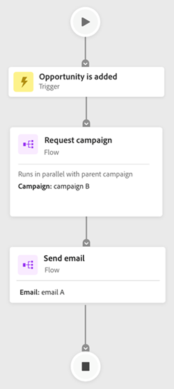

# Guia Mapa de engajamento {#engagement-map-tab}

O Mapa de engajamento é representado por meio de uma série de acionadores, filtros e cartões de fluxo. Clicar em cada cartão revelará informações adicionais.

Visão geral do acionador: este cartão mostra o número de acionadores em sua campanha. Clicar nele revelará um cartão para cada acionador, bem como um painel deslizante com as seguintes informações:

* Campanha à qual o acionador pertence
* Lista de nomes de acionadores
* Editar acionador

  

Trigger Detail: esse cartão mostra o nome do acionador. Ao clicar nele, um painel deslizante será exibido com as seguintes informações:

* Campanha à qual o acionador pertence
* Lista de restrições associadas ao acionador
* Editar acionador

Filtro: ao clicar neste cartão, será exibido um painel deslizante com as seguintes informações:

* Campanha à qual o filtro pertence
* Número estimado de pessoas qualificadas para o filtro
* Lista de filtros e suas respectivas restrições
* Editar filtro

  

Etapas de Fluxo: Se uma Etapa de Fluxo incluir opções, este cartão mostrará o nome da Etapa de Fluxo. Ao clicar nele, um painel deslizante será exibido com as seguintes informações:

* Campanha à qual a Etapa de fluxo pertence
* Lista de condições de escolha associadas à Etapa de fluxo
* Editar etapa do fluxo

Etapas de fluxo: se uma Etapa de fluxo não _não_ incluir quaisquer opções, este cartão mostrará os atributos associados à Etapa de fluxo. Ao clicar nele, um painel deslizante será exibido com as seguintes informações:

* Campanha à qual a Etapa de fluxo pertence
* Lista de atributos associados à Etapa de fluxo
* Editar etapa do fluxo

  

## Etapa de fluxo para executar e solicitar campanhas {#flow-step-for-execute-and-request-campaigns}

* Se a Etapa Executar ou Solicitar Fluxo de Campanha não incluir opções, o cartão mostrará o nome da campanha. Clicar no cartão revelará um painel deslizante com as seguintes informações:

   * Campanha à qual a Etapa de fluxo pertence
   * Editar etapa do fluxo
   * Lista de atributos associados à Etapa de fluxo
   * Botão &quot;Exibir lista&quot;, que abre uma lista de campanhas que usam a Campanha de Solicitação/Execução específica

>[!NOTE]
>
>Você pode editar as Etapas de fluxo de uma campanha principal. Para editar campanhas aninhadas, é necessário navegar até a campanha através do link no painel deslizante.

* Se a Etapa de fluxo de campanha Executar ou Solicitar incluir opções, clicar no cartão revelará um painel deslizante com as seguintes informações:

   * Campanha à qual a Etapa de fluxo pertence
   * Lista de condições de escolha associadas à Etapa de fluxo
   * Editar etapa do fluxo

* Se uma Campanha Executar ou Solicitar incluir opções, clicar no cartão de fluxo expandirá para mostrar todas as opções em cartões individuais. Ao clicar no botão _opção_ expandirá a campanha associada à escolha específica, bem como revelará um painel deslizante com as seguintes informações:

   * Campanha à qual a escolha pertence
   * Editar escolha
   * Lista de condições de escolha associadas à Etapa de fluxo
   * Lista de exibição, que abre uma lista de campanhas que usam a Campanha de Solicitação/Execução específica

  

## Visualização de uma campanha de execução aninhada {#visualizing-a-nested-execute-campaign}

Executar campanhas executadas em série com a campanha principal. As pessoas qualificadas para uma campanha executável concluem todas as Etapas de fluxo da campanha e retornam à campanha principal para continuar pelas Etapas de fluxo desta campanha.

Veja abaixo um exemplo de uma Campanha inteligente, &quot;Campanha A&quot;, que inclui uma Etapa de execução do fluxo da campanha. Pense na &quot;Campanha A&quot; como sua campanha principal.

1. Clicar no cartão de fluxo executar campanha expandirá para mostrar detalhes da &quot;Campanha B&quot;.
1. A &quot;Campanha B&quot; inclui um filtro que divide o público em dois grupos: qualificado e não qualificado.
1. O público qualificado passa pelas Etapas de fluxo associadas à &quot;Campanha B&quot;.
1. Todo o público (qualificado e não qualificado) retorna para a &quot;Campanha A&quot; e avança para a próxima Etapa de fluxo.

   

Você pode clicar na Etapa Executar Fluxo da Campanha na &quot;Campanha B&quot;, que se expandirá para mostrar os cartões de escolha e a campanha associada a cada escolha.

## Visualização da campanha de solicitação {#visualizing-request-campaign}

As campanhas de solicitação são executadas em paralelo com a campanha principal. As pessoas qualificadas para uma campanha de solicitação concluem todas as Etapas de fluxo da campanha e depois saem da campanha. Simultaneamente, o mesmo conjunto de pessoas passa pelas Etapas de fluxo da campanha principal.

Este é um exemplo de uma Campanha inteligente, &quot;Campanha A&quot;, que inclui uma etapa de fluxo de campanha de solicitação. Pense na &quot;Campanha A&quot; como sua campanha principal.

1. Clicar no cartão de fluxo de campanha de solicitação se expandirá para mostrar os detalhes da &quot;Campanha B&quot;
1. A &quot;Campanha B&quot; inclui um filtro que divide o público em dois grupos: qualificado e não qualificado.
1. O público qualificado passa pelas Etapas de fluxo associadas à &quot;Campanha B&quot;.
1. Ao mesmo tempo, todo o público-alvo passa para as próximas Etapas de fluxo na &quot;Campanha A&quot;.

   

Você pode se aprofundar em suas campanhas aninhadas se qualquer uma das Etapas de fluxo incluir outra campanha de solicitação clicando no cartão de fluxo para visualizar os detalhes da campanha.

Este é um exemplo de uma campanha de solicitação com opções.

## Tratamento de erros {#error-handling}

Os erros nas Smart Lists e nas etapas de fluxo serão destacados por meio de um ícone vermelho no cartão. Além disso, uma mensagem de erro correspondente será refletida no painel deslizante.

Os avisos em Smart Lists e Etapas de fluxo serão destacados por meio de um ícone laranja no cartão. Além disso, uma mensagem de aviso correspondente será refletida no painel deslizante.

Abaixo está um exemplo de um aviso em um cartão Opção, que é exibido no cartão de etapa Executar fluxo do Campaign, no painel deslizante e no cartão Opção padrão.

>[!NOTE]
>
>Os avisos são recomendações a serem analisadas, mas não indicam erros na Campanha inteligente.

**Os erros nos cartões de filtro podem incluir:**

* Um erro na Smart List que resultará na não exibição do público qualificado

* Um erro na lógica do filtro

* Um erro em restrições (ou falta delas) em um ou mais filtros

  

>[!NOTE]
>
>Os erros em uma campanha aninhada não estarão visíveis até que você clique para expandir a campanha aninhada.
