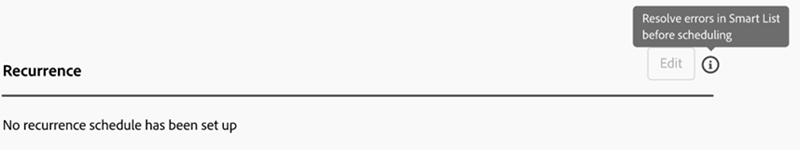

# Guia Configurações {#settings-tab}

A guia Settings é o local de todas as configurações da campanha, incluindo os mesmos conjuntos de permissões e acesso que a guia Schedule em Smart Campaigns.

Ele inclui as três seções a seguir.

* **Regras de qualificação**: determina quantas vezes cada pessoa pode executar o fluxo da Campanha Inteligente.

* **Execuções individuais**: podem ser usadas para agendar execuções únicas imediatamente ou no futuro.

* **Recorrência**: usado para agendar uma recorrência diária, semanal ou mensal.

  

As regras de qualificação estarão disponíveis para todas as campanhas (acionador e lote) e incluem as seguintes configurações:

* Você pode determinar quantas vezes uma pessoa passa por uma campanha
* A capacidade de bloquear uma campanha não operacional se a pessoa estiver acima do limite de comunicação
* A capacidade de definir um limite de pessoas de campanha abortada

  

As execuções individuais podem ser usadas para executar uma campanha imediatamente ou para configurar algumas execuções pontuais no futuro.

>[!TIP]
>
>É mais fácil usar o modal de recorrência se você estiver agendando uma série de campanhas.

O modal de recorrência inclui a capacidade de configurar um agendamento recorrente em uma base diária, semanal ou mensal. Depois de configurado, você poderá ver as próximas três execuções na guia Configurações.

A guia Configurações também inclui uma visão geral rápida da Campanha inteligente. Ele inclui o seguinte:

* Status da campanha
* Criado em
* Última modificação
* Modo de lista inteligente
* Status da lista inteligente:
   * Estimativa de pessoas que serão afetadas
   * Pessoas estimadas que estão bloqueadas de emails
   * Pessoas estimadas que estão em uma etapa de espera

Conjuntos de permissões e erros na guia Configurações:

Todos os conjuntos de permissões existentes serão aplicáveis na guia Configurações. Se o botão Editar estiver acinzentado, clique no ícone de ajuda para descobrir o motivo.

>[!NOTE]
>
>Se, depois de clicar no ícone de ajuda, você visualizar &quot;Permissão adicional necessária&quot;, entre em contato com o administrador do Marketo.

