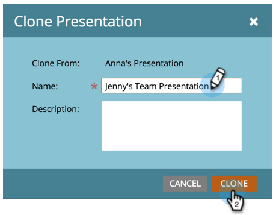

# Clonar uma apresentação {#clone-a-presentation}

Clonar uma apresentação para reutilização em locais diferentes.

1. Selecione a apresentação que deseja clonar.

   

1. Clique com o botão direito do mouse na apresentação e selecione **[!UICONTROL Clonar]**.

   

1. Insira um nome para a apresentação clonada e clique em **[!UICONTROL Clonar]**.

   

   Já existe uma cópia exata da sua apresentação.
