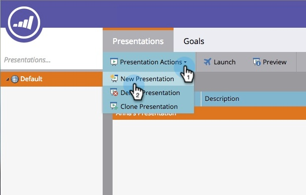

# Criar uma Apresentação {#create-a-presentation}

Crie uma apresentação para projetar as visualizações e metas do calendário da sua equipe em uma TV de alta definição. Presentations são específicos do Espaço de trabalho.

>[!AVAILABILITY]
>
>
>Nem todos os usuários do Marketo Engage compraram essa funcionalidade. Entre em contato com a equipe de conta do Adobe (seu gerente de conta) para obter mais detalhes.

1. Vá para a **[!UICONTROL Calendário]**.

   

1. Clique em **[!UICONTROL Presentations]** no canto inferior direito.

   

1. Clique em **[!UICONTROL Ações de apresentação]** e selecione **[!UICONTROL Nova apresentação]**.

   

1. Escolha um nome para a apresentação. Clique em **[!UICONTROL Criar]**.

   

   Excelente! Agora você está pronto para personalizar sua apresentação.

>[!MORELIKETHIS]
>
>[Personalizar uma Apresentação](/help/marketo/product-docs/core-marketo-concepts/marketing-calendar/calendar-hd/customize-a-presentation.md)
