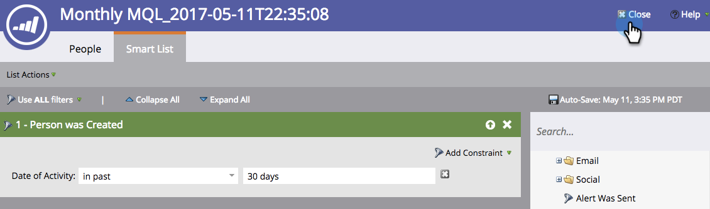

# Criar uma meta de Smart List {#create-a-smart-list-goal}

Metas são formas de acompanhar o progresso e motivar a sua equipe. Eles podem ser combinados com listas inteligentes para rastrear todos os tipos de coisas no Marketo. Além disso, depois de configurar uma meta de lista inteligente, ela será atualizada automaticamente a cada 2 horas quando for usada em uma apresentação.

Como as apresentações, as metas são [espaço de trabalho](/help/marketo/product-docs/administration/workspaces-and-person-partitions/understanding-workspaces-and-person-partitions.md)específico.

1. Vá para o **Calendário**.

   

1. Clique em **Apresentação** no canto inferior direito.

   

1. Selecione o **Metas** guia .

   

1. Arrastar e soltar **Meta da Lista Inteligente** na tela.

   

1. Insira um nome para a meta e insira um **Meta do Target**. Em seguida, clique em **Criar**.

   

1. [Definir a lista inteligente](/help/marketo/product-docs/core-marketo-concepts/smart-lists-and-static-lists/creating-a-smart-list/find-and-add-filters-to-a-smart-list.md). As possibilidades são infinitas!

   

1. Depois que a lista inteligente estiver configurada, clique no botão **Fechar** e retorne à guia anterior.

   

   Olha isso! Sua meta da lista inteligente foi criada.

   
