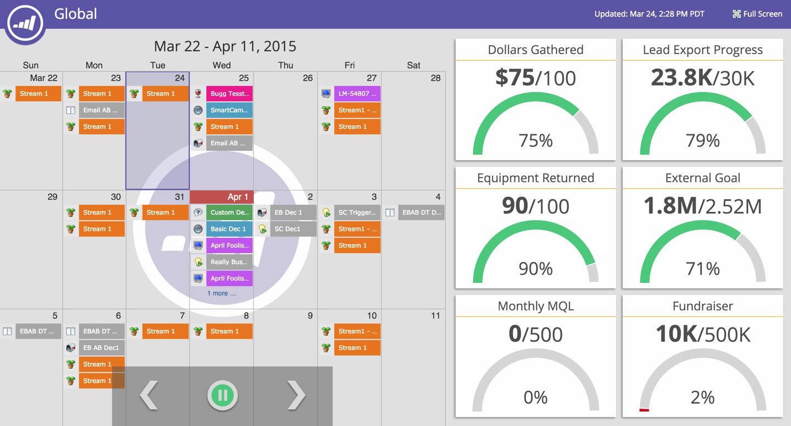

# Personalizar uma Apresentação {#customize-a-presentation}

Configure a apresentação do seu calendário para refletir as metas e atividades mais importantes para a sua equipe.

>[!AVAILABILITY]
>
>
>Nem todos os clientes compraram essa funcionalidade. Confira os detalhes com seu representante de vendas.

>[!PREREQUISITES]
>
>* [Criar metas personalizadas](/help/marketo/product-docs/core-marketo-concepts/marketing-calendar/calendar-hd/create-a-custom-goal.md){target="_blank"} or [Smart List Goals](/help/marketo/product-docs/core-marketo-concepts/marketing-calendar/calendar-hd/create-a-smart-list-goal.md){target="_blank"}
>
>* [Criar uma Apresentação](/help/marketo/product-docs/core-marketo-concepts/marketing-calendar/calendar-hd/create-a-presentation.md){target="_blank"}

## Escolhendo as Views {#choosing-the-views}

O Presentations circula por diferentes [definições de filtro](/help/marketo/product-docs/core-marketo-concepts/marketing-calendar/working-with-the-calendar/filtering-the-marketing-calendar.md){target="_blank"} você escolhe. Retire quantas visualizações desejar e personalize a frequência.

1. Na árvore direita, arraste as diferentes exibições que você deseja girar na sua apresentação.

   

## Adicionar uma meta {#add-a-goal}

Os Presentations são os mais incríveis quando exibem as metas da sua equipe. Basta arrastar sobre diferentes [metas personalizadas](/help/marketo/product-docs/core-marketo-concepts/marketing-calendar/calendar-hd/create-a-custom-goal.md){target="_blank"} or [smart list goals](/help/marketo/product-docs/core-marketo-concepts/marketing-calendar/calendar-hd/create-a-smart-list-goal.md){target="_blank"}. Você pode usar até 10.

1. Na árvore direita, arraste as metas diferentes que deseja exibir na sua apresentação.

   

## Definir a frequência de rotação {#set-the-frequency-of-rotation}

Depois de obter as exibições desejadas na apresentação, defina a frequência com que ela gira entre as diferentes exibições.

1. Clique em **[!UICONTROL 5 minutos]** (esta é a cadência padrão).

   

1. Insira um horário usando minutos. Clique em **[!UICONTROL Salvar]**.

   >[!NOTE]
   >
   >Exibir uma exibição estática verificando **[!UICONTROL Desativar rotação]**.

   

## Definir a exibição do calendário {#set-the-calendar-display}

A exibição do calendário pode ser alterada para uma exibição de 3 semanas ou mensal.

1. Selecione o **[!UICONTROL Exibição do calendário]** e escolha entre **[!UICONTROL 3 semanas]** ou um **[!UICONTROL Month]**.

   

   Ótimo! Pronto para ver sua apresentação?

>[!TIP]
>
>Defina um [imagem de plano de fundo](/help/marketo/product-docs/core-marketo-concepts/marketing-calendar/calendar-hd/add-a-background-image-to-a-presentation.md){target="_blank"} para a sua apresentação. Sugerimos gatinhos ou arco-íris.

## Visualizar uma Apresentação {#preview-a-presentation}

Após a configuração da apresentação, ela estará pronta para ser visualizada e iniciada.

1. Selecionar **[!UICONTROL Visualizar]**.

   

   Ta-da! Esta pode ser a sua apresentação.

   

   Não gosta do que você vê? Retorne e use diferentes definições de filtro para criar a exibição desejada.

>[!MORELIKETHIS]
>
>* [Adicionar uma Imagem de Plano de Fundo a uma Apresentação](/help/marketo/product-docs/core-marketo-concepts/marketing-calendar/calendar-hd/add-a-background-image-to-a-presentation.md){target="_blank"}
>* [Iniciar uma Apresentação](/help/marketo/product-docs/core-marketo-concepts/marketing-calendar/calendar-hd/launch-a-presentation.md){target="_blank"}
