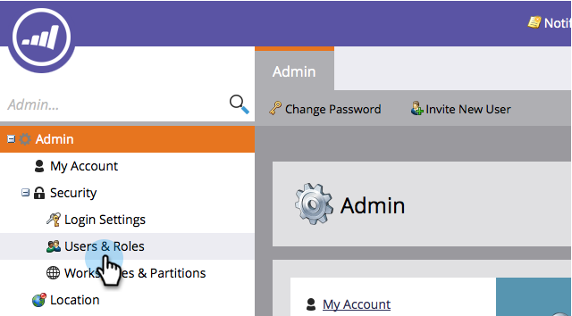

# Emitir/revogar uma licença do calendário de marketing {#issue-revoke-a-marketing-calendar-license}

>[!NOTE]
>
>**Permissões de administrador necessárias**

Para usar suas estações do [Calendário de marketing](/help/marketo/product-docs/core-marketo-concepts/marketing-calendar/understanding-the-calendar/navigating-the-marketing-calendar.md){target="_blank"}, você precisa emitir licenças para usuários que precisam de acesso. Veja como.

1. Vá para a seção **[!UICONTROL Admin]**.

   

1. Clique em **[!UICONTROL Usuários e funções]**.

   

1. Selecione o(s) usuário(s) e clique em **[!UICONTROL Emitir licença]**.

   >[!TIP]
   >
   >Use o **Ctrl/Cmd+clique** para selecionar vários usuários de uma só vez.

   

1. Marque **[!UICONTROL Habilitar licença]** e clique em **[!UICONTROL Salvar]**.

   >[!NOTE]
   >
   >Há um limite de 5 licenças. Se precisar de mais, entre em contato com seu representante de vendas.

   

   Muito bem! Está vendo a marca de seleção verde em &#39;[!UICONTROL Calendário]?&#39;

   
