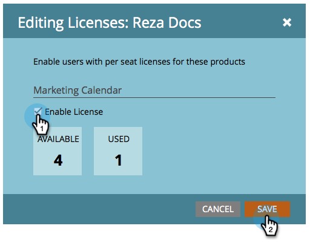

# Emitir/Revogar uma Licença de Calendário de Marketing {#issue-revoke-a-marketing-calendar-license}

>[!NOTE]
>
>**Permissões de administrador necessárias**

Para usar seus assentos de [Calendário de marketing](/help/marketo/product-docs/core-marketo-concepts/marketing-calendar/understanding-the-calendar/navigating-the-marketing-calendar.md), é necessário emitir licenças para usuários que precisam de acesso. Veja como.

1. Vá para a seção **Admin**.

   

1. Clique em **Usuários e funções**.

   

1. Selecione os usuários e clique em **Emitir Licença.**

   >[!TIP]
   >
   >Use **Ctrl/Cmd+clique** para selecionar vários usuários de uma só vez.

   

1. Marque **Ativar Licença** e clique em **Salvar.**

   >[!NOTE]
   >
   >Há um limite de 5 licenças. Se precisar de mais, entre em contato com seu representante de vendas.

   

   Muito bem! Consulte a marca de seleção verde em &quot;Calendário?&quot;

   

Awesome - Você está pronto para começar a agendar!
