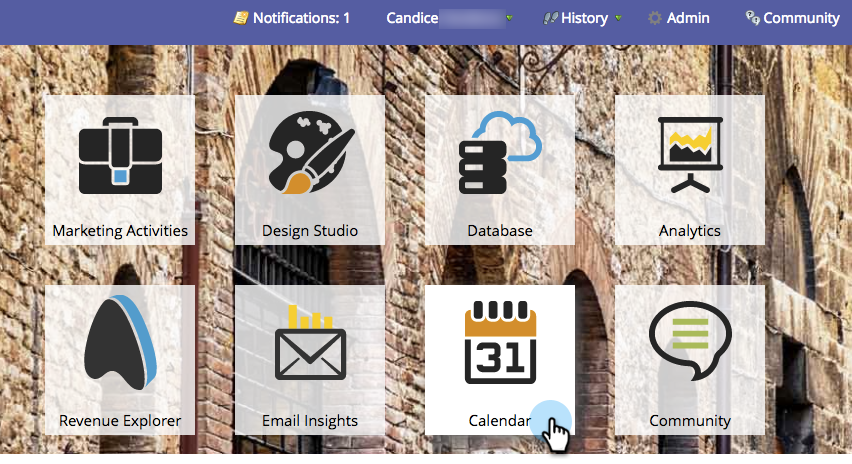

# Navegação no calendário de marketing {#navigating-the-marketing-calendar}

Navegar ao redor do Calendário de marketing é fácil como um, dois, três!

>[!PREREQUISITES]
>
>Certifique-se de que você tenha uma [Licença de calendário de marketing](/help/marketo/product-docs/core-marketo-concepts/marketing-calendar/understanding-the-calendar/issue-revoke-a-marketing-calendar-license.md) - caso contrário, o bloco Calendário de marketing não será exibido em Meu Marketo.

1. Vá para o **Calendário de marketing**.

   

1. Essa é uma exibição de pássaro dos ativos agendados em sua instância do Marketo.

   

## Alteração entre modos {#change-between-modes}

1. Clique no botão **3 semanas** ou **Mês** guias para alternar entre modos.

   

## Usar a Exibição de Agenda {#use-the-agenda-view}

A exibição Agenda exibe todas as suas entradas como uma lista.

1. Clique no botão **Menu suspenso Filtro**.

   

1. Selecione o **Agenda** exibir.

   

   Ótimo! Esta é uma ótima visão para ver tudo o que está planejado.

   

## Navegar pelo tempo {#navigate-through-time}

Sem um DeLorean! Basta clicar nos botões de navegação.

Também é possível usar esses atalhos de teclado.

| Ação | Atalho de teclado |
|---|---|
| Voltar no tempo | alt/opt + up |
| Avançar no tempo | alt/opt + down |
| Ir para &quot;hoje&quot; | alt/opt + t |

Ótimo! Estas são as noções básicas. Você também pode personalizar sua visualização usando filtros.

>[!MORELIKETHIS]
>
>[Filtrar o calendário de marketing](/help/marketo/product-docs/core-marketo-concepts/marketing-calendar/working-with-the-calendar/filtering-the-marketing-calendar.md)
