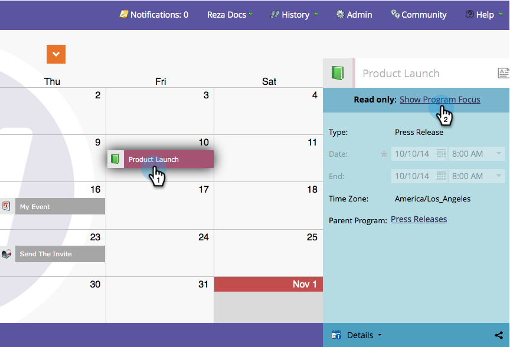

# Entender/Ativar foco do programa {#understand-enable-program-focus}

O Calendário de marketing oferece uma visão abrangente das coisas, mas também permite algumas interações. Você pode [criar](/help/marketo/product-docs/core-marketo-concepts/marketing-calendar/working-with-the-calendar/create-entries-directly-in-the-marketing-calendar.md){target="_blank"}, [editar](/help/marketo/product-docs/core-marketo-concepts/marketing-calendar/working-with-the-calendar/edit-entries-directly-in-the-marketing-calendar.md){target="_blank"}, [excluir](/help/marketo/product-docs/core-marketo-concepts/marketing-calendar/working-with-the-calendar/delete-entries-directly-in-the-marketing-calendar.md){target="_blank"} e [confirmar](/help/marketo/product-docs/core-marketo-concepts/marketing-calendar/working-with-the-calendar/confirm-entries-directly-in-the-marketing-calendar.md){target="_blank"} entradas. Para interagir com as entradas, você deve se concentrar em um programa primeiro.

1. Vá para o **Calendário de marketing**.

   

1. Selecione uma entrada e clique em **[!UICONTROL Mostrar Foco do Programa]**.

   

1. Observe que agora estamos focados em nosso programa chamado &quot;Press Release&quot;.

   

   >[!NOTE]
   >
   >Focar em um programa permite interagir somente com entradas que pertencem a ele e criar novas entradas que serão abrigadas por ele.

1. Quando terminar, libere o foco para interagir com outros programas/entradas.

   

Fantástico! Agora vá em frente e aprenda a interagir com as entradas.

>[!MORELIKETHIS]
>
>* [Criar Entradas Diretamente no Calendário de Marketing](/help/marketo/product-docs/core-marketo-concepts/marketing-calendar/working-with-the-calendar/create-entries-directly-in-the-marketing-calendar.md){target="_blank"}
>* [Editar Entradas Diretamente no Calendário de Marketing](/help/marketo/product-docs/core-marketo-concepts/marketing-calendar/working-with-the-calendar/edit-entries-directly-in-the-marketing-calendar.md){target="_blank"}
>* [Excluir Entradas Diretamente no Calendário de Marketing](/help/marketo/product-docs/core-marketo-concepts/marketing-calendar/working-with-the-calendar/delete-entries-directly-in-the-marketing-calendar.md){target="_blank"}
>* [Confirmar Entradas Diretamente no Calendário de Marketing](/help/marketo/product-docs/core-marketo-concepts/marketing-calendar/working-with-the-calendar/confirm-entries-directly-in-the-marketing-calendar.md){target="_blank"}
