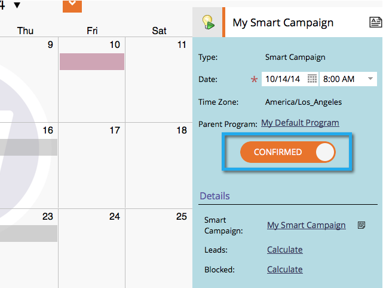

# Confirmar entradas diretamente no calendário de marketing {#confirm-entries-directly-in-the-marketing-calendar}

Campanhas inteligentes e programas de e-mail podem ser criados como entradas experimentais e devem ser confirmados para que algo realmente aconteça. Veja como.

1. Vá para o **[!UICONTROL Calendário]**.

   

1. Selecione a entrada que deseja confirmar e clique em **[!UICONTROL Mostrar Foco do Programa]**.

   

1. Continue e confirme a entrada.

   

   A confirmação executa uma série de processos de validação e, se tudo for verificado, a entrada será confirmada.

   
