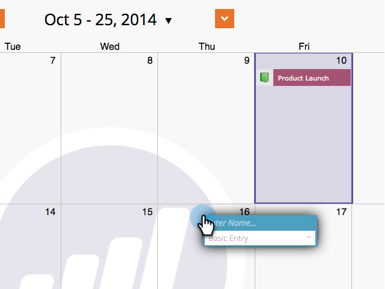
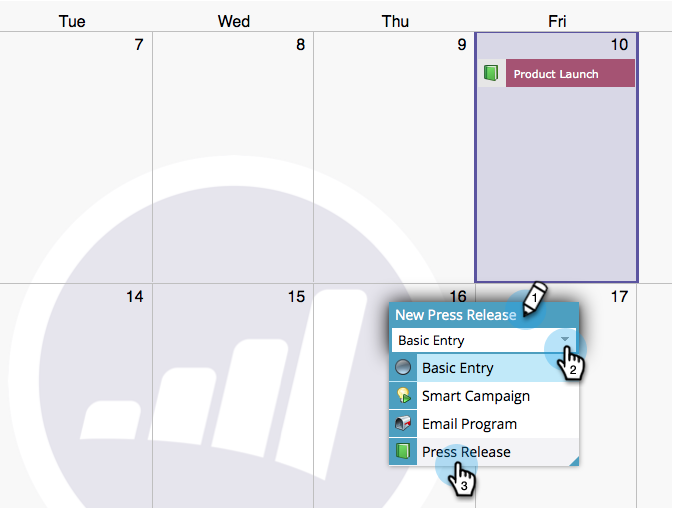
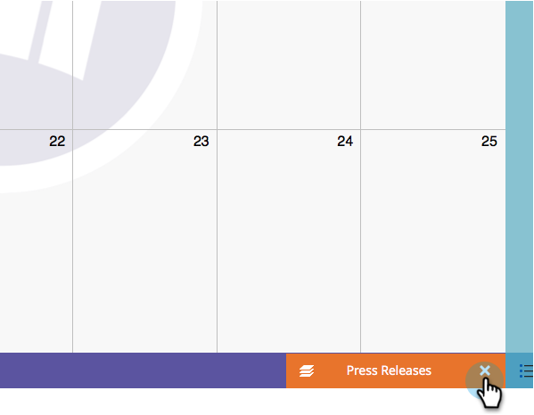

# Criar entradas diretamente no calendário de marketing {#create-entries-directly-in-the-marketing-calendar}

O Marketo permite criar entradas diretamente no seu Calendário de marketing usando o modo de foco do programa. Você pode criar os seguintes tipos de entrada:

* Entradas básicas
* Entradas Personalizadas
* Programas de email
* Campanhas inteligentes

1. Clique no bloco **[!UICONTROL Calendário]**.

   

1. Selecione uma entrada anterior e clique em **[!UICONTROL Mostrar foco do programa]**.

   

1. No modo de foco do programa, selecione o dia de sua escolha para adicionar uma entrada.

   

1. Nomeie a entrada e selecione um tipo.

   

   >[!TIP]
   >
   >Observe que você também pode criar **Campanhas inteligentes**, **Programas de email** e **Entradas básicas** da mesma maneira.

1. Quando terminar a edição, feche o modo de foco do programa.

   

>[!MORELIKETHIS]
>
>[Editar Entradas Diretamente no Calendário de Marketing](/help/marketo/product-docs/core-marketo-concepts/marketing-calendar/working-with-the-calendar/edit-entries-directly-in-the-marketing-calendar.md){target="_blank"}
