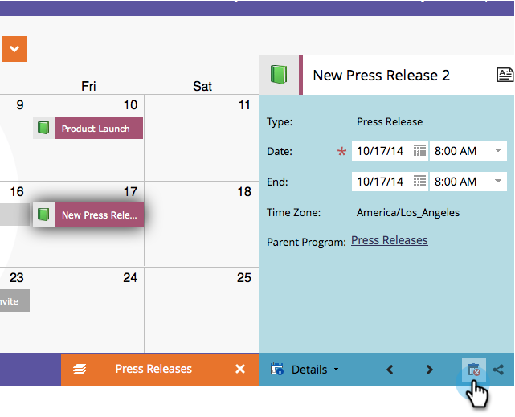

# Excluir entradas diretamente no calendário de marketing {#delete-entries-directly-in-the-marketing-calendar}

Além de [criar](/help/marketo/product-docs/core-marketo-concepts/marketing-calendar/working-with-the-calendar/create-entries-directly-in-the-marketing-calendar.md){target="_blank"} e [editar](/help/marketo/product-docs/core-marketo-concepts/marketing-calendar/working-with-the-calendar/edit-entries-directly-in-the-marketing-calendar.md){target="_blank"} entradas, você pode excluí-las diretamente no Calendário de marketing.

1. Clique no bloco **MU**.

   

1. Selecione a entrada que deseja excluir e clique em **[!UICONTROL Mostrar Foco do Programa]**.

   

1. Clique no ícone da lixeira.

   

Dependendo da entrada, talvez seja necessário confirmar a exclusão.

>[!MORELIKETHIS]
>
>[Confirmar Entradas Diretamente no Calendário de Marketing](/help/marketo/product-docs/core-marketo-concepts/marketing-calendar/working-with-the-calendar/confirm-entries-directly-in-the-marketing-calendar.md){target="_blank"}
