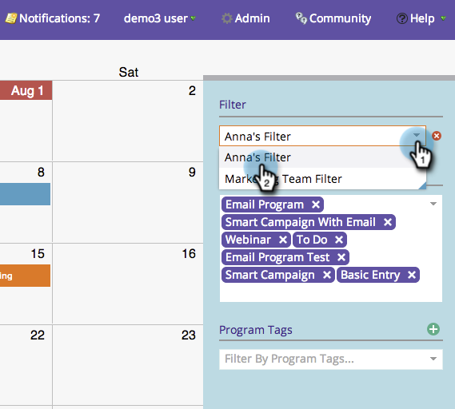

# Excluir um filtro no calendário de marketing {#deleting-a-filter-in-the-marketing-calendar}

Se deseja excluir um filtro no Calendário de marketing, você chegou ao lugar certo.

1. Selecione o filtro que deseja excluir.

   

1. Clique no **x** vermelho.

   

1. Clique em **[!UICONTROL Excluir]** para confirmar.

   
