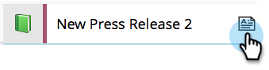
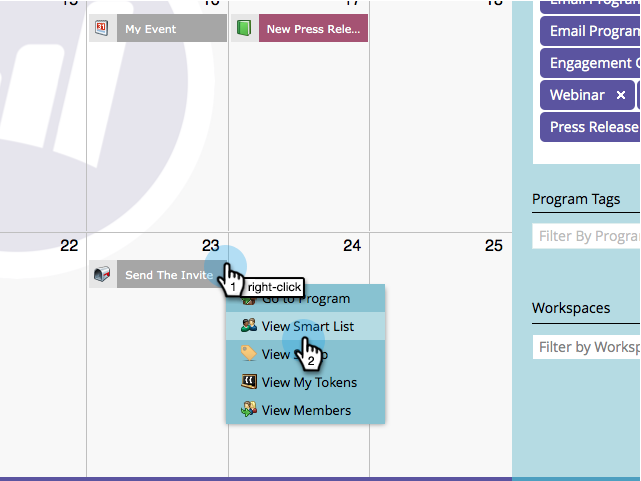

# Editar entradas diretamente no calendário de marketing {#edit-entries-directly-in-the-marketing-calendar}

Quando estiver no modo de foco do programa, você poderá fazer rapidamente alterações nas entradas do calendário. Veja como.

## Ativar foco do programa {#enable-program-focus}

1. Clique no bloco **[!UICONTROL Calendário]**.

   

1. Selecione uma entrada que pertença ao programa no qual você deseja se concentrar e clique em **[!UICONTROL Mostrar Foco do Programa]**.

   

## Reprogramar Entrada {#reschedule-entry}

1. Basta arrastar e soltar uma entrada para reagendá-la.

   

## Editar nome de entrada {#edit-entry-name}

1. Selecione a entrada que deseja renomear.

   

1. Edite o nome da entrada.

   

   >[!TIP]
   >
   >Também é possível editar a descrição.
   >
   >

## Converter tipo de entrada {#convert-entry-type}

Depois de ter desenhado rapidamente as suas entradas básicas, você poderá convertê-las para a sua forma final.

1. Localize e selecione a entrada básica que deseja converter e alterar seu tipo.

   

## Editar detalhes da entrada {#edit-entry-details}

Você pode obter acesso rápido a diferentes áreas de suas entradas para edição.

1. Clique com o botão direito do mouse em uma entrada e selecione a área que deseja editar.

   

Pronto! Como você pode ver, há muitas coisas que você pode fazer diretamente do Calendário de marketing.

>[!MORELIKETHIS]
>
>[Excluir Entradas Diretamente no Calendário de Marketing](/help/marketo/product-docs/core-marketo-concepts/marketing-calendar/working-with-the-calendar/delete-entries-directly-in-the-marketing-calendar.md){target="_blank"}
