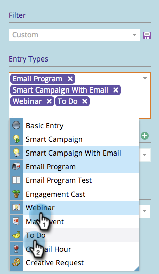

# Filtrar o calendário de marketing {#filtering-the-marketing-calendar}

Use tipos de entrada, marcas de programa ou espaços de trabalho para filtrar as informações exibidas no calendário.

1. Clique no bloco **[!UICONTROL Calendário]**.

1. Clique no menu suspenso **[!UICONTROL Tipo de entrada]**.

   >[!NOTE]
   >
   >Os tipos de entrada padrão serão **[!UICONTROL Email]** **[!UICONTROL Programas]** e **[!UICONTROL Campanhas inteligentes com Email]**.

   

1. Escolha outros tipos de entrada para adicionar ao filtro.

   

   >[!TIP]
   >
   >Para obter descrições dos tipos de entrada padrão, consulte [Tipos de Entrada de Exibição de Agendamento de Programa](/help/marketo/product-docs/core-marketo-concepts/programs/program-schedule-view/program-schedule-view-entry-types.md){target="_blank"}.

1. Selecione as tags de programa de seu interesse.

   

1. Selecione o valor da tag.

   

   Somente as entradas que correspondem ao filtro definido agora estarão visíveis.

   >[!NOTE]
   >
   >[Salvando uma Definição de Filtro no Calendário de Marketing](/help/marketo/product-docs/core-marketo-concepts/marketing-calendar/working-with-the-calendar/saving-a-filter-definition-in-the-marketing-calendar.md){target="_blank"}
