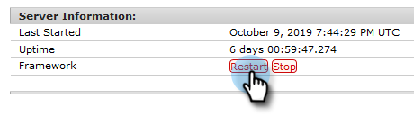
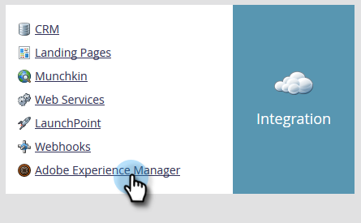

# Configuração da integração ao Adobe Experience Manager {#configuring-adobe-experience-manager-integration}

Configure o Adobe Experience Manager (AEM) para poder acessar, selecionar e importar ativos do AEM para o Marketo Engage Design Studio.

>[!NOTE]
>
>**Permissões de administrador são necessárias**

>[!IMPORTANT]
>
>* Essa integração funciona somente com implementações no local do AEM e não é compatível com implementações do AEM Cloud Service.
>
>* Atualmente, esse recurso é totalmente compatível apenas com o Firefox. Ele não é compatível com o Safari e pode não funcionar na versão mais recente do Chrome, dependendo das configurações de cookie SameSite.

1. Navegue até a Adobe Experience Manager (o URL é específico da sua empresa).

   

1. Você pode fazer logon com a Adobe ou localmente. Este exemplo usa logon local.

   

1. Em **[!UICONTROL Ferramentas]**, clique em **[!UICONTROL Operações]** e selecione **[!UICONTROL Console da Web]**.

   

1. Em seu navegador, pesquise (ctrl+f no Windows, cmd+f no Mac) por &quot;[!UICONTROL Política de Compartilhamento de Recursos entre Origens do Adobe Granite].&quot;

   

1. Clique no sinal **+** à direita.

   

1. Na caixa de texto **[!UICONTROL Origens permitidas (Regexp)]**, digite `https://.*\.marketo\.com` e clique em **[!UICONTROL Salvar]**.

   

1. No cabeçalho na parte superior da página, clique em **[!UICONTROL Console da Web]** e selecione **[!UICONTROL Informações do Sistema]**.

   

1. Em Informações do Servidor, clique no botão **[!UICONTROL Reiniciar]**.

   

1. Clique em **[!UICONTROL OK]** para confirmar.

   

1. No Marketo Engage, clique em **[!UICONTROL Admin]**.

   

1. Em Integração, selecione **[!UICONTROL Adobe Experience Manager]**.

   

1. Clique em **[!UICONTROL Editar]**.

   

1. Insira sua URL do AEM e clique em **[!UICONTROL OK]**.

   
