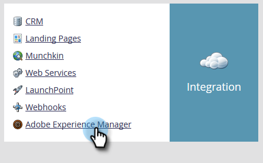

# Configuração da integração Adobe Experience Manager {#configuring-adobe-experience-manager-integration}

Configure AEM para que você possa acessar, selecionar e importar ativos AEM no Design Studio do Marketo.

>[!NOTE]
>
>**Permissões de administrador necessárias**

>[!CAUTION]
>
>Atualmente, esse recurso é totalmente compatível apenas com o Firefox. Ele não é suportado no Safari e pode não funcionar na versão mais recente do Chrome (v. 80), dependendo das configurações de cookie do SameSite.

1. Navegue até o Adobe Experience Manager (o URL é específico para a sua empresa).

   

1. Você pode fazer logon com Adobe ou fazer logon localmente. Neste exemplo, entraremos localmente.

   

1. Em **Ferramentas**, clique em **Operações** e selecione Console **da Web**.

   

1. No seu navegador, procure &quot;Adobe Granite Cross-Origem Resource Sharing Policy&quot; (Política de compartilhamento de recursos entre  do) (ctrl+f no Windows, cmd+f no Mac).

   

1. Clique no **+** sinal à direita.

   

1. Na caixa de texto Origens **permitidas (Regexp)** , digite &quot;https://.*\.marketo\.com&quot; (sem as aspas) e clique em **Salvar**.

   

1. No cabeçalho na parte superior da página, clique em Console **da** Web e selecione Informações **** do sistema.

   

1. Em Informações do servidor, clique no botão **Reiniciar** .

   

1. Clique em **OK** para confirmar.

   

1. No Marketo Classic, clique em **Admin**.

   

1. Em Integração, selecione **Adobe Experience Manager**.

   

1. Clique em **Editar**.

   

1. Insira seu URL AEM e clique em **OK**.

   

   Vocês estão prontos! Agora você pode [importar ativos AEM para o Design Studio no Marketo Sky](http://help.marketo.com/hc/en-us/articles/360036765993).

