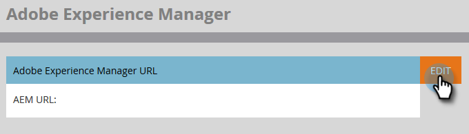

# Configuração da integração do Adobe Experience Manager {#configuring-adobe-experience-manager-integration}

Configure o Adobe Experience Manager (AEM) para que você possa acessar, selecionar e importar AEM ativos no Marketo Engage Design Studio.

>[!NOTE]
>
>**Permissões de administrador necessárias**

>[!IMPORTANT]
>
>* Essa integração só funciona com implementações locais de AEM e não é compatível com implementações do AEM Cloud Service.
>
>* No momento, esse recurso é totalmente compatível com o Firefox. Ele não é compatível com o Safari e pode não funcionar na versão mais recente do Chrome, dependendo das configurações de cookie do SameSite.

1. Navegue até a Adobe Experience Manager (o URL é específico para sua empresa).

   

1. Você pode fazer logon com o Adobe ou fazer logon localmente. Neste exemplo, entraremos localmente.

   

1. Em **Ferramentas**, clique em **Operações** e selecione **Console da Web**.

   

1. No seu navegador, pesquise (ctrl+f no Windows, cmd+f no Mac) por &quot;Política de compartilhamento de recursos entre origens do Adobe Granite&quot;.

   

1. Clique no botão **+** assine à direita.

   

1. No **Origens Permitidas (Regexp)** caixa de texto, digite `https://.*\.marketo\.com` e clique em **Salvar**.

   

1. No cabeçalho na parte superior da página, clique em **Console da Web** e selecione **Informações do sistema**.

   

1. Em Informações do servidor, clique no botão **Reiniciar** botão.

   

1. Clique em **OK** para confirmar.

   

1. No Marketo Engage, clique em **Administrador**.

   

1. Em Integração, selecione **Adobe Experience Manager**.

   

1. Clique em **Editar**.

   

1. Insira o URL do AEM e clique em **OK**.

   
