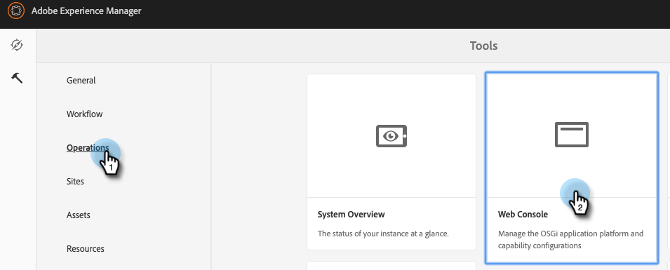

# Configurar a integração do Adobe Experience Manager {#configuring-adobe-experience-manager-integration}

Configure AEM para que você possa acessar, selecionar e importar ativos AEM no Marketo Design Studio.

>[!NOTE]
>
>**Permissões de administrador necessárias**

>[!CAUTION]
>
>No momento, esse recurso é totalmente compatível com o Firefox. Ele não é compatível com o Safari e pode não funcionar na versão mais recente do Chrome (v. 80), dependendo das configurações de cookie do SameSite.

1. Navegue até a Adobe Experience Manager (o URL é específico para sua empresa).

   

1. Você pode fazer logon com o Adobe ou fazer logon localmente. Neste exemplo, entraremos localmente.

   

1. Em **Ferramentas**, clique em **Operações** e selecione **Console da Web**.

   

1. No seu navegador, pesquise (ctrl+f no Windows, cmd+f no Mac) por &quot;Política de compartilhamento de recursos entre origens do Adobe Granite&quot;.

   

1. Clique no sinal **+** à direita.

   

1. Na caixa de texto **Origens permitidas (Regexp)**, digite `https://.*\.marketo\.com` e clique em **Salvar**.

   

1. No cabeçalho na parte superior da página, clique em **Console da Web** e selecione **Informações do Sistema**.

   

1. Em Informações do servidor, clique no botão **Reiniciar**.

   

1. Clique em **OK** para confirmar.

   

1. No Marketo Classic, clique em **Admin**.

   

1. Em Integração, selecione **Adobe Experience Manager**.

   

1. Clique em **Editar**.

   

1. Insira o URL do AEM e clique em **OK**.

   

   Está tudo pronto! Agora você pode [importar ativos AEM para o Design Studio no Marketo Sky](https://experienceleague.adobe.com/docs/marketo/sky/design-studio/importing-assets-with-adobe-experience-manager.html?lang=en#design-studio).
